# Analisi dei dati

Ora vedremo come ho affrontato questo test e l'analisi che ho compiuto.

* [Prefazione](#prefazione)
* [Metodo d'analisi](#metodo-danalisi)
  * [Sintesi Semplice](#sintesi-semplice)
  * [Dati Analizzati](#dati-analizzati)
  * [Test statistico utilizzato](#test-statistico-utilizzato)
  * [Formula di calcolo](#formula-di-calcolo)
  * [Risultai principali](#risultati-principali)
  * [Come leggere il p-value](#come-leggere-il-p-value)
  * [Esempio passo-passo](#esempio-passo-passo-dado-d16-red)
  * [Confronto con i valori critici](#confronto-con-i-valori-critici)
  * [Il numero di lanci è sufficiente?](#il-numero-di-lanci-è-sufficiente)
* [Conclusioni](#conclusioni)
  * [link](#link)
* [Appendice I](#appendice-i---stranezze-riscontrate)
* [Appendice II](#appendice-ii---frequenze-osservate-per-tutti-i-dadi)
* [Ringraziamenti](#Ringraziamenti)

## Prefazione

Per questa analisi ho effettuato 1008 lanci con il seguente set di dadi:


|              d16<br>Red              |                d16White                |                d8White                |              d8<br>Green              |              d8<br>Yellow              |              d8<br>Red              |
| :-------------------------------------: | :---------------------------------------: | :-------------------------------------: | :-------------------------------------: | :--------------------------------------: | :-----------------------------------: |
| 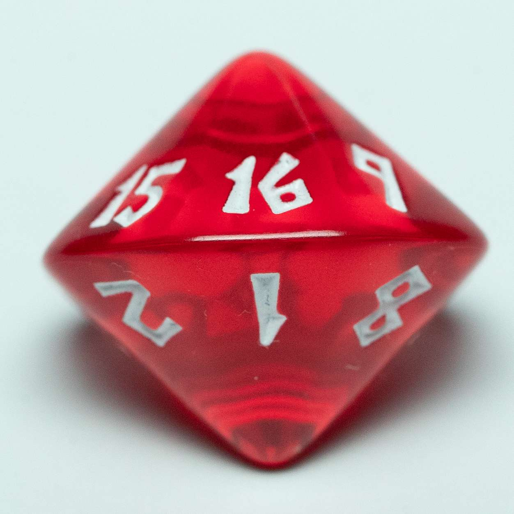 | 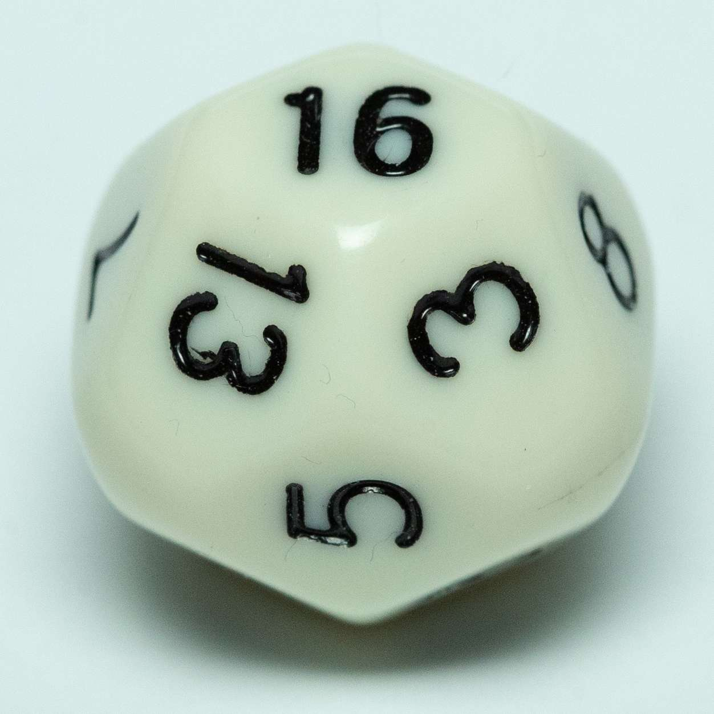 | 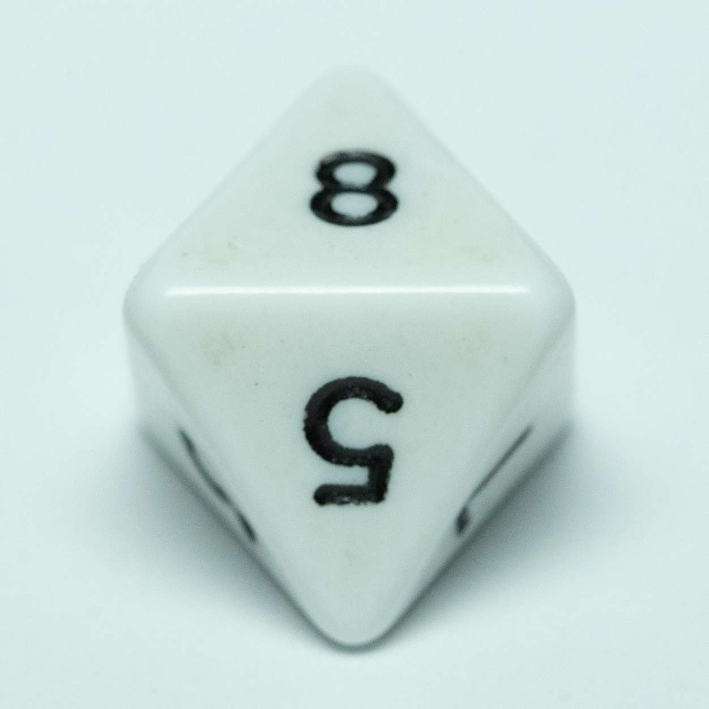 | 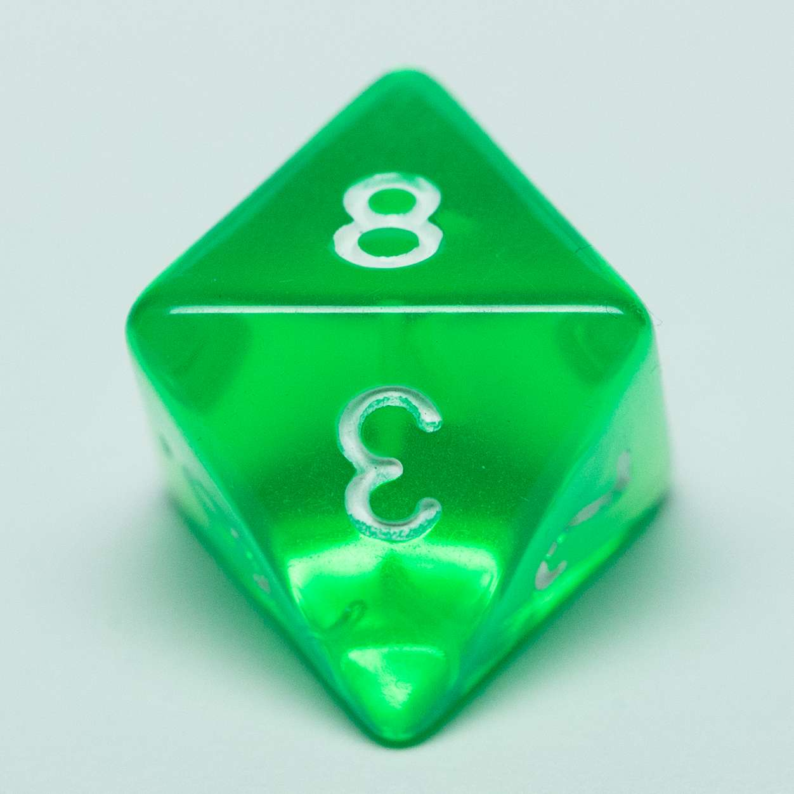 | 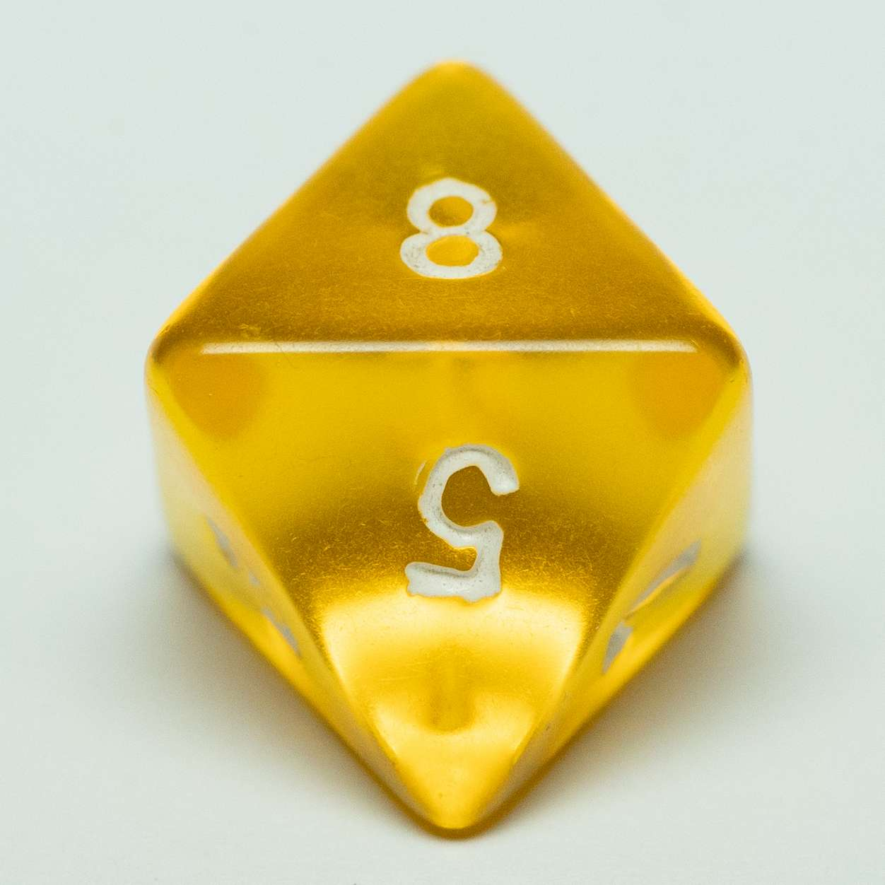 | 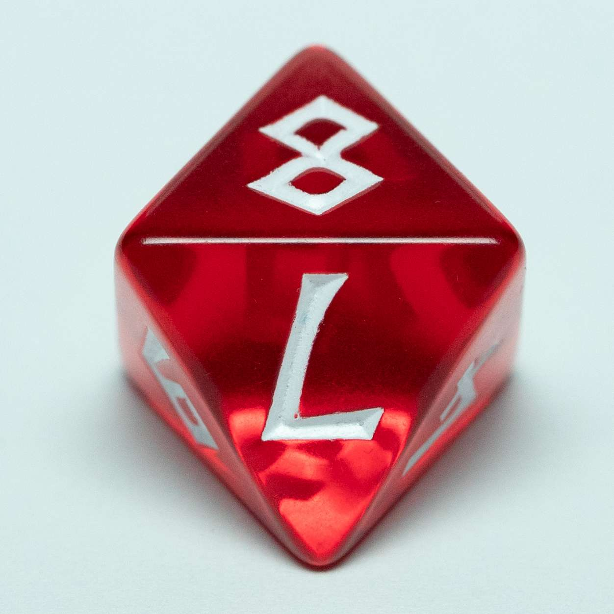 |
|       d16 del set<br>Blood Bowl       |            d16<br>from China            |               d8<br>old               |               d8<br>new               |             d8<br>very old             |      d8 del set<br>Blood Bowl      |

Provenienza di questi dadi:

* *d16 red e d8 red*
  * Sono due dadi del [:link:set di Warhammer Blood Bowl](https://www.warhammer.com/it-IT/shop/Blood-Bowl-Dice-Set-2019);
* *d16 white*
  * Uno dei [:link:d16 acquistati su Amazon](https://amzn.to/48HkGFp);
* *d8 green*
  * si tratta di un dato arrivato con il [:link:GdR Dragondale](https://www.genitoridiruolo.com/dragondale/), pertanto nuovo nuovo, ho aperto il kit di dadi per questo test;
* *d8 white e d8 yellow*
  * sono miei dadi usati da circa 30 anni, ovvero quando iniziai a giocatore GdR;

Ed ecco la panoramica dei dadi utilizzati per questo test.

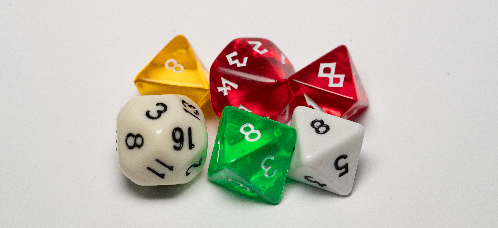

I d16, pertanto, sono nuovi nuovi, acquistati appositamente per questo test.
Dei 4 dadi a 8 facce, ne abbiamo due nuovi, inaugurati per questo test e due molto vecchi ed usati.

I lanci sono stati eseguiti variando molto il pattern, di seguito elenco alcune modalità di lancio per far capire la variabilità applicata:

* lancio di un solo dado, lancio a mano su un tavolo
  * applicato al 15% dei lanci
* lancio di più dadi contemporaneamente a mano su un tavolo
  * applicato al 15% dei lanci
* lancio di più dadi, a mano all'interno di uno spazio confinato (scatola)
  * applicato al 35% dei lanci
* lancio di più dadi, inseriti in un bicchiere su un tavolo
  * applicato al 15% dei lanci
* lancio di più dadi, inseriti in un bicchiere all'interno di uno spazio confinato (scatola)

Ed ecco la foto dei dadi nella scatola, con tanto di bicchiere utilizzato per i lanci.

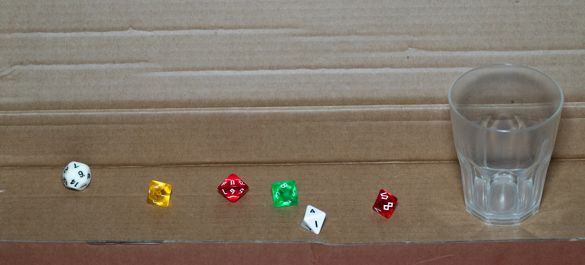

I risultati dei lanci sono consultabili in [:link:questa tabella](./result.md).

## Metodo d'analisi

Per analizzare i dati raccolti, ho applicato una *Analisi statistica dell'uniformità di dadi d16 e d8*

Il metodo d'analisi applicato è il _Test chi-quadrato sui lanci registrati e implicazioni per la generazione di entropia_.
Per maggiori informazioni sul test applicato, vi lascio la [:link:pagina wikipedia](https://it.wikipedia.org/wiki/Distribuzione_chi_quadrato) con i dettagli.

### Sintesi semplice

Sono stati analizzati 6 dadi, ciascuno lanciato 1008 volte: due dadi da 16 facce e quattro dadi da 8 facce.<br>L'obiettivo era verificare se le frequenze osservate sono compatibili con l'ipotesi che ogni faccia abbia la stessa probabilità di uscire.

Il test utilizzato è il test chi-quadrato di bontà dell'adattamento.<br>
Confrontando con una soglia standard alfa = 0,05, tre dadi risultano statisticamente sospetti. Il caso più forte è d16, con *p-value* estremamente basso.

Attenzione: rifiutare test di indagine, non significa dimostrare che un dado è "truccato". Significa solo che i risultati osservati sono poco compatibili con un dado perfettamente uniforme.

### Dati analizzati

La [tabella dei risultati](./result.md) riporta i dadi divisi in colonna per ogni dado.<br>
Ogni colonna riporta la sequenza dei 1008 risultati osservati nei lanci.


|   **Dado**   | **Numero<br>facce** | **Numero<br>lanci** | **Valore<br>atteso** |
| :------------: | :-------------------: | :-------------------: | :--------------------: |
|  d16<br>Red  |         16         |        1008        |          63          |
| d16<br>White |         16         |        1008        |          63          |
| d8<br>White |          8          |        1008        |         126         |
| d8<br>Green |          8          |        1008        |         126         |
| d8<br>Yellow |          8          |        1008        |         126         |
|  d8<br>Red  |          8          |        1008        |         126         |

### Test statistico utilizzato

Per ogni dado è stato fatto lo stesso test: il test chi-quadrato di bontà dell'adattamento.
Questo test serve a confrontare le frequenze osservate con le frequenze attese se il dado fosse perfettamente uniforme.

#### Ipotesi del test

**Ipotesi nulla *H0***: *il dado è equo*, quindi tutte le facce hanno la stessa probabilità di uscire.

**Ipotesi alternativa *H1***: *il dado non è perfettamente equo*, cioè almeno una faccia ha probabilità diversa dalle altre.

In un d16, per l'ipotesi *H0*, ogni faccia ha probabilità 1/16 = 6,25%.
Per un d8, per l'ipotesi *H0*, ogni faccia ha probabilità 1/8 = 12,5%.

### Formula di calcolo

Per ogni faccia si calcola un contributo al valore chi-quadrato:

> **χ² = Σ \[(Oᵢ − Eᵢ)² / Eᵢ\]**

Dove **Oᵢ** è il numero di volte in cui è uscita la faccia **i**, mentre **Eᵢ** è il numero atteso di uscite della stessa faccia se il dado fosse uniforme.

Per praticità i calcoli sono stai effettuati con un foglio di calcolo.<br>Per verificare i miei calcoli, di seguito riporto la funzione da utilizzare con il programma Excel, presente nel pacchetto MS-Office.

```=TEST.CHI.QUAD(intervallo_osservati; intervallo_attesi)```<br>
Di cui trovate le specifiche su [:link:questo sito](https://support.microsoft.com/it-it/office/test-chi-quad-funzione-test-chi-quad-2e8a7861-b14a-4985-aa93-fb88de3f260f).

Per effettuare il test con Open/Libre Office, invece, vi invito a consultare [:link:questa pagina](https://help.libreoffice.org/latest/it/text/scalc/01/statistics_test_chisqr.html?DbPAR=CALC&System=Unknown%20OS).

Il *p-value* viene poi confrontato con **alfa = 0,05**.

### Risultati principali


|     **Dado**     | **χ²<br>calcolato** | **g.l.** | **p-value** | **p-value<br>%** | **Confronto<br>con 0,05** |     **Decisione**     | **Significato**                                               |
| :----------------: | :---------------------: | :--------: | :-----------: | :----------------: | :-------------------------: | :---------------------: | --------------------------------------------------------------- |
|  **d16**<br>Red  |        27.143        |    15    |   0.0276   |       2.8%       |          < 0,05          |   **Rifiuto**<br>H0   | *Sospetto:*<br>distribuzione poco compatibile con uniformità |
| **d16**<br>White |        73.302        |    15    |  1.15e-09  |    0,0% circa    |          < 0,05          |   **Rifiuto**<br>H0   | *Sospetto:*<br>distribuzione poco compatibile con uniformità |
| **d8**<br>White |         8.095         |    7    |   0.3243   |      32.4%      |          ≥ 0,05          | **Non rifiuto**<br>H0 | **Compatibile** con casualità normale                        |
| **d8**<br>Green |        10.794        |    7    |   0.1479   |      14.8%      |          ≥ 0,05          | **Non rifiuto**<br>H0 | **Compatibile** con casualità normale                        |
| **d8**<br>Yellow |         3.048         |    7    |   0.8806   |      88.1%      |          ≥ 0,05          | **Non rifiuto**<br>H0 | **Compatibile** con casualità normale                        |
|  **d8**<br>Red  |        16.651        |    7    |   0.0198   |       2.0%       |          < 0,05          |   **Rifiuto**<br>H0   | *Sospetto:*<br>distribuzione poco compatibile con uniformità |

### Come leggere il p-value

Il *p-value* risponde alla domanda: se il dado fosse davvero equo, quanto sarebbe probabile osservare una deviazione almeno così grande da quella rilevata nei dati?

Regola usata: se *p-value* < 0,05, si **rifiuta** *H0*; se p-value ≥ 0,05, **non si rifiuta** *H0*.

"**Non rifiuto *H0***" non significa dimostrare che il dado è perfetto. Significa solo che, con questi dati, non ci sono evidenze sufficienti per dire che sia sbilanciato.

### Esempio passo-passo: dado **d16 Red**

Per il primo dado, **d16 Red**, i lanci totali sono 1008.<br>Poiché il dado ha 16 facce, il valore atteso per ciascuna faccia è 1008 / 16 = 63.


| Faccia | Osservato<br>**O** | Atteso<br>**E** | **O-E** | Contributo<br>**χ²** |
| :------: | :------------------: | :---------------: | :-------: | :----------------------: |
|   1   |         74         |       63       |   +11   |         1.921         |
|   2   |         69         |       63       |   +6   |         0.571         |
|   3   |         58         |       63       |   \-5   |         0.397         |
|   4   |         56         |       63       |   \-7   |         0.778         |
|   5   |         71         |       63       |   +8   |         1.016         |
|   6   |         66         |       63       |   +3   |         0.143         |
|   7   |         54         |       63       |   \-9   |         1.286         |
|   8   |         66         |       63       |   +3   |         0.143         |
|   9   |         54         |       63       |   \-9   |         1.286         |
|   10   |         52         |       63       |  \-11  |         1.921         |
|   11   |         73         |       63       |   +10   |         1.587         |
|   12   |         51         |       63       |  \-12  |         2.286         |
|   13   |         83         |       63       |   +20   |         6.349         |
|   14   |         48         |       63       |  \-15  |         3.571         |
|   15   |         56         |       63       |   \-7   |         0.778         |
|   16   |         77         |       63       |   +14   |         3.111         |

Sommando i contributi della tabella si ottiene χ² = 27,143.<br>I gradi di libertà sono 16 − 1 = 15.<br>Da questo valore, il foglio di calcolo calcola *p-value* = 0,0276, cioè 2,76%.

> Poiché 2,76% è minore di 5%, si rifiuta H0 al livello di significatività 0,05.

### Confronto con i valori critici

Un modo equivalente di leggere il test è confrontare il valore **χ²** calcolato con il valore critico della distribuzione chi-quadrato.


| **Tipo dado** | **g.l.** | **Valore critico<br>95%** | **Valore critico<br>99%** | **Regola<br>al 95%**                       | **Regola<br>al 99%** |
| :-------------: | :--------: | :-------------------------: | :-------------------------: | -------------------------------------------- | ---------------------- |
|      d16      |    15    |          24.996          |          30.578          | Rifiuto H0 se χ²<br>supera questo valore | Regola più severa   |
|      d8      |    7    |          14.067          |          18.475          | Rifiuto H0 se χ²<br>supera questo valore | Regola più severa   |

I pratica, con un livello di significatività α = 0,05, equivalente a confidenza 95%, mentre con un livello di significatività α = 0,01, equivalente a confidenza 99%.

### Il numero di lanci è sufficiente?

Per applicare il test chi-quadrato serve che le frequenze attese siano sufficientemente grandi.<br>Una regola minima comune è avere almeno 5 osservazioni attese per categoria.<br>In questo caso siamo molto oltre: 63 per ogni faccia nei d16 e 126 per ogni faccia nei d8.

Quindi i 1008 lanci per dado sono sufficienti per uno screening statistico serio e per rilevare bias evidenti.<br>Non sono però una prova definitiva per escludere bias piccoli: per quello servirebbero più lanci.


| **Obiettivo**               | **Lanci indicativi<br>per dado** | **Interpretazione**                                       |
| ----------------------------- | :--------------------------------: | ----------------------------------------------------------- |
| Controllo iniziale          |             500-1000             | Buono per individuare anomalie evidenti                   |
| Buona affidabilità pratica |            3000-5000            | Utile per confermare casi borderline                      |
| Test robusto                |              10000+              | Più adatto se si vogliono rilevare bias moderati/piccoli |
| Bias molto piccoli          |              50000+              | Necessario se il requisito è molto severo                |

## Conclusioni

Questo test è iniziato per confermare che il dado da 16 facce cinese (denominato d16 White), non potesse generare risultati accettabili.<br>
Quando durante il test, ho iniziato a parlarne in rete, mi è stato presentato il dado da 16 facce di Warhammer (denominato d16 Red), così ho deciso di introdurre anche questo dado nel test.<br>
Procedendo con i lanci, ho osservato risultati non troppo omogenei nemmeno con il d16 Red, così ho voluto aggiungere un altro tipo di dadi al test.<br>
Ho pensato ad un dado che avesse le seguenti caratteristiche:

* fosse un solido platonico;
* potesse sostituire facilmente il d16 per la generazione della seed.

Avendo a disposizione ben 4 dadi da 8 facce, ho deciso di inserirli tutti nel test.

Tirando le somme:

* con valore critico 99%:
  * con il **d16 Withe** rifiuto l'ipotesi H0
* con valore critico 95%
  * rifiuto H0 con: **d16 White**, con **d16 Red**, ma anche con **d8 Red**

Rimanendo nell'ambito del valore critico 95%, I risultati mettono in evidenza due punti:

* rifiuto H0 con **tutti i d16**
* rifiusto H0 con **tutti i dadi del set di Warhammer** che sono stati oggetto del test.

**il rifiuto di H0** indica che i risultati sono distanti dal test di ipotesi;<br>
questo si traduce in una distribuzione **non omogenea** dei risultati (alcune facce hanno più probabilità di altre di comparire).<br>
Questa mancanza di omogeneità, **io la interpreto come SCARSA ENTROPIA** e questo mi porta a scartare l'idea di utilizzare d16 ed anche dadi provenienti dal set di Warhammer Blood Bowl.

Questa è l'idea che mi sono fatto io, ma lascio a voi decidere a che tipo di dado volete utilizzare per creare la *chiave di accesso al vostro oro digitale?*<br>

> *Ai posteri l'ardua sentenza.*
> cit.

Ai divulgatori che ancora vorranno consigliare l'utilizzo di un d16, continuo a ripetere: *mettete almeno un disclaimer sul tipo di dado da 16 da utilizzare*, onde evitare che utenti poco attenti acquistino un d16 fallace come quello da me [acquistato su Amazon](https://amzn.to/48HkGFp).

### Link

* Torna alla [:link: pagina principale](./README.md) della guida
* consulta i risultati dei [:link: lanci effettuati](./result.md)

## Appendice I - Stranezze riscontrate

Aggiungo quì alcune stranezze riscontrate durante il test.
Ho sempre saputo che la somma di due facce opposte del dado, dovessero restituire il valore massimo di quel dado addizionato di 1.<br>
Dei d8 da me utilizzati, però, soltanto due rispettano questa metrica, metre altri due no.<br>
Non ritengo che la metrica possa influenzare il risultato, ma, stranamente, i due dadi le cui facce rispettavano questa metrica hanno prodotto risultati puù omogenei.<br>
Di seguito riporto una tabella che riporta la faccia del dato ed il suo opposto nei vari dadi esaminati:


| Faccia | d8 Whtie<br> d8 Yellow | d8 Red | d8 Green |
| :------: | :----------------------: | :------: | :--------: |
|   1   |           8           |   6   |    2    |
|   2   |           7           |   7   |    1    |
|   3   |           6           |   8   |    4    |
|   4   |           5           |   5   |    3    |
|   5   |           4           |   4   |    6    |
|   6   |           3           |   1   |    5    |
|   7   |           2           |   2   |    8    |
|   8   |           1           |   3   |    7    |

I due dadi che rispettano la metrica, sono anche i più vecchi (credo oltre 30 anni);<br>
All'inizio del test, mi sarei aspettato che fossero questi dadi a restituire di valori meno omogenei data l'usura, invece, contrariamente a quanto mi sarei aspettato, il dado che ha mostrato i risultati più coerenti con l'ipotesi è stato il d8 Yellow che tra tutti è il più usato.

Una mia deduzione (non supportata da alcun dato specifico) è che i dadi vecchi fossero costruiti con una qualità superiore a quelli moderni che ho utilizzato per il test e che sia solo questa qualità superiore che abbia permesso risultati più omogenei e non la metrica delle facce opposte.

## Appendice II - Frequenze osservate per tutti i dadi

### d16 Red


| **Faccia** | Osservato<br>**O** | Atteso<br**E** | **O-E** | Contributo<br>**χ²** |
| :----------: | :------------------: | :--------------: | :-------: | :----------------------: |
|     1     |         74         |       63       |   +11   |         1.921         |
|     2     |         69         |       63       |   +6   |         0.571         |
|     3     |         58         |       63       |   \-5   |         0.397         |
|     4     |         56         |       63       |   \-7   |         0.778         |
|     5     |         71         |       63       |   +8   |         1.016         |
|     6     |         66         |       63       |   +3   |         0.143         |
|     7     |         54         |       63       |   \-9   |         1.286         |
|     8     |         66         |       63       |   +3   |         0.143         |
|     9     |         54         |       63       |   \-9   |         1.286         |
|     10     |         52         |       63       |  \-11  |         1.921         |
|     11     |         73         |       63       |   +10   |         1.587         |
|     12     |         51         |       63       |  \-12  |         2.286         |
|     13     |         83         |       63       |   +20   |         6.349         |
|     14     |         48         |       63       |  \-15  |         3.571         |
|     15     |         56         |       63       |   \-7   |         0.778         |
|     16     |         77         |       63       |   +14   |         3.111         |

### d16 White

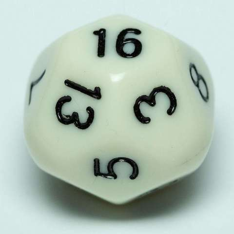


| **Faccia** | Osservato<br>**O** | Atteso<br**E** | **O-E** | Contributo<br>**χ²** |
| :----------: | :------------------: | :--------------: | :-------: | :----------------------: |
|     1     |         56         |       63       |   \-7   |         0.778         |
|     2     |         59         |       63       |   \-4   |         0.254         |
|     3     |         52         |       63       |  \-11  |         1.921         |
|     4     |         57         |       63       |   \-6   |         0.571         |
|     5     |         38         |       63       |  \-25  |         9.921         |
|     6     |         85         |       63       |   +22   |         7.683         |
|     7     |         87         |       63       |   +24   |         9.143         |
|     8     |         84         |       63       |   +21   |         7.000         |
|     9     |         91         |       63       |   +28   |         12.444         |
|     10     |         74         |       63       |   +11   |         1.921         |
|     11     |         55         |       63       |   \-8   |         1.016         |
|     12     |         44         |       63       |  \-19  |         5.730         |
|     13     |         60         |       63       |   \-3   |         0.143         |
|     14     |         72         |       63       |   +9   |         1.286         |
|     15     |         60         |       63       |   \-3   |         0.143         |
|     16     |         34         |       63       |  \-29  |         13.349         |

### d8 White

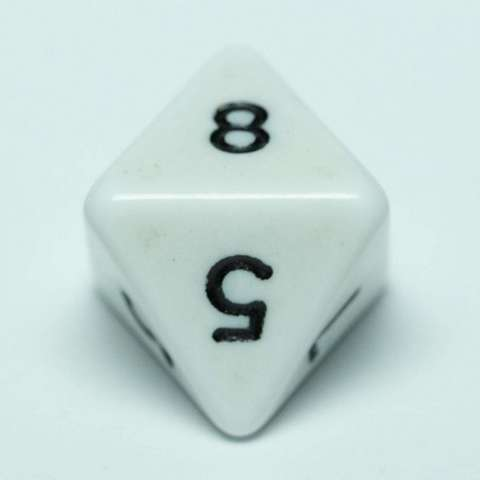


| **Faccia** | Osservato<br>**O** | Atteso<br**E** | **O-E** | Contributo<br>**χ²** |
| :----------: | :------------------: | :--------------: | :-------: | :----------------------: |
|     1     |        125        |      126      |   \-1   |         0.008         |
|     2     |        154        |      126      |   +28   |         6.222         |
|     3     |        127        |      126      |   +1   |         0.008         |
|     4     |        126        |      126      |   +0   |         0.000         |
|     5     |        116        |      126      |  \-10  |         0.794         |
|     6     |        119        |      126      |   \-7   |         0.389         |
|     7     |        117        |      126      |   \-9   |         0.643         |
|     8     |        124        |      126      |   \-2   |         0.032         |

### d8 Green


| **Faccia** | Osservato<br>**O** | Atteso<br**E** | **O-E** | Contributo<br>**χ²** |
| :----------: | :------------------: | :--------------: | :-------: | :----------------------: |
|     1     |        118        |      126      |   \-8   |         0.508         |
|     2     |        112        |      126      |  \-14  |         1.556         |
|     3     |        157        |      126      |   +31   |         7.627         |
|     4     |        133        |      126      |   +7   |         0.389         |
|     5     |        122        |      126      |   \-4   |         0.127         |
|     6     |        126        |      126      |   +0   |         0.000         |
|     7     |        119        |      126      |   \-7   |         0.389         |
|     8     |        121        |      126      |   \-5   |         0.198         |

### d8 Yellow

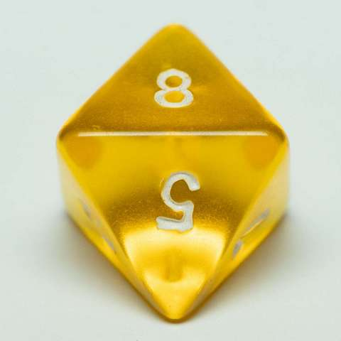


| **Faccia** | Osservato<br>**O** | Atteso<br**E** | **O-E** | Contributo<br>**χ²** |
| :----------: | :------------------: | :--------------: | :-------: | :----------------------: |
|     1     |        125        |      126      |   \-1   |         0.008         |
|     2     |        116        |      126      |  \-10  |         0.794         |
|     3     |        137        |      126      |   +11   |         0.960         |
|     4     |        125        |      126      |   \-1   |         0.008         |
|     5     |        131        |      126      |   +5   |         0.198         |
|     6     |        132        |      126      |   +6   |         0.286         |
|     7     |        126        |      126      |   +0   |         0.000         |
|     8     |        116        |      126      |  \-10  |         0.794         |

### d8 Red


| **Faccia** | Osservato<br>**O** | Atteso<br**E** | **O-E** | Contributo<br>**χ²** |
| :----------: | :------------------: | :--------------: | :-------: | :----------------------: |
|     1     |        101        |      126      |  \-25  |         4.960         |
|     2     |        153        |      126      |   +27   |         5.786         |
|     3     |        123        |      126      |   \-3   |         0.071         |
|     4     |        137        |      126      |   +11   |         0.960         |
|     5     |        139        |      126      |   +13   |         1.341         |
|     6     |        105        |      126      |  \-21  |         3.500         |
|     7     |        126        |      126      |   +0   |         0.000         |
|     8     |        124        |      126      |   \-2   |         0.032         |

## Ringraziamenti

Sono sempre d'obbligo i ringraziamenti a *il Leo* per tutto il sostegno che mi ha dato, ma per i calcoli statistici devo ringraziare un frequentatore del più grande *Satoshi Spitz d'Italia*, ovviamente quello di Torino. Grazie *Mario*, senza il tuo aiuto, questa pagina non avrebbe avuto la coerenza mi hai aiutato a donargli.<br>
Un sentito ringraziamento anche a tutti coloro che dietro le quinte mi aiutano a sistemare la grammatica.

Torna a i [link](#link).
