# SeedPhrase, Dadi e **Security Tradeoff**

### Chiunque si sia dimostrato interessato a Bitcoin, prima o poi ha dovuto affrontare la generazione di una SeedPhrase.

Ci sono svariati metodi per generare questa serie di 12 o 24 parole, ma ognuno ha differenti livelli di entropia e, di conseguenza, differenti livelli di sicurezza. 
Una volta generata la SeedPhrase, sarà poi necessario conservarla in maniera sicura, ma questo è un discorso che magari affronteremo in un altro momento.

# Generazione SeedPhrase con i dadi

Non è mia intenzione fare l'ennesima guida di come generare la SeedPhrase, ma voglio solo mettervi a conoscenza di considerazioni che ho fatto nel tempo.

### Monete o Dadi 6 facce

Come sapete, per descrivere in maniera binaria il numero corrispondente alle 2048 parole introdotte con il [:link: BIP39](https://github.com/bitcoin/bips/tree/master/bip-0039), servono 11 bit, per questo motivo vengono spesso utilizzate 11 monete oppure 11 dadi.

Se non conoscete questa pratica, vi consiglio di leggere la guida redatta da [:link: Turtlecute](https://github.com/Turtlecute33) e pubblicata su suo sito: [:link: turtlecute.org/seed](https://turtlecute.org/seed/). La stessa procedura può essere utilizzata utilizzando 11 monete.

Ho appositamente menzionato le monete, perché ritengo che possa essere più semplice recuperare 11 monete identiche piuttosto che 11 dadi. 
E' anche vero che si può utilizzare un solo dado e lanciarlo 11 volte per ogni parola da generare, ma la procedura risulterà molto più lunga.

A questo proposito, però, vi segnalo un metodo che ha ideato **Il Leo** e che permette di generare la SeedPhrase lanciando un solo dado da 6, un numero limitato di volte. 
La guida pubblicata da **Il Leo** è stata presenta allo *Spazio21 di Lugano* nel 2025.  
Se vi siete persi il suo speech, potrete trovare la sua guida su questo gruppo Telegram: [:link: ABC del ₿itcoin](https://t.me/+GlEaD0WD53BmNGE0) e interagire con lui per qualsiasi domanda.

---

### Altri tipi di Dadi

Mi è capitato di imbattermi in guide che esortano gli utenti ad utilizzare altri tipi di dadi.
La maggior parte di queste guide alternative, però, spingono gli utenti ad utilizzare i ***dadi da 16 facce*** :interrobang:.

Da giocatore di **D&D** (il più famoso [GdR](https://it.wikipedia.org/wiki/Gioco_di_ruolo)), quasi cascai dalla sedia quando sentii nominare questi dadi.

* :bangbang: Mai sentiti;
* :bangbang: Mai utilizzati;
* :bangbang: Mai visti in nessun negozio e nessuna fiera.

Così, pieno di curiosità e aspettative, ho acquistato (*voi non fatelo*) [questi dadi](https://amzn.to/48HkGFp) da 16 facce su Amazon :shit:. 
All'arrivo ho subito notato che le 16 facce non erano tutte uguali, anzi, erano presenti 3 tipi di facce differenti ed oltretutto erano **forme geometriche IRREGOLARI**. 
Spinto dalla filosofia *"don't trust, verify"*, mi sono lanciato nella sperimentazione e nella ricerca.

Mi sono documentato sull'origine dei dadi e mi sono imbattuto in una informazione che i miei lontani studi di Geometria, non avevano afferrato: **I Solidi Platonici**. Questo argomento è molto importante in questo contesto, pertanto ve ne faccio un accenno:

## I Solidi Platonici

**Platone**, insieme al suo maestro **Socrate** e al suo allevo **Aristotele** ha posto le basi del *pensiero filosofico occidentale*. 
La rilevanza tra un filosofo e la geometria, a noi non interessa, quello che invece è fondamentale è capire le caratteristiche di un **Solido Platonico** e perché la sua regolarità è molto importante.

Il **solido platonico**, sinonimo di **solido regolare** e di **poliedro convesso regolare**, indica un [poliedro convesso](https://it.wikipedia.org/wiki/Poliedro_convesso) con le seguenti caratteristiche:

* le sue [:link: facce](https://it.wikipedia.org/wiki/Faccia_(geometria)) hanno tutte la stessa superficie, essendo [:link: poligoni regolari](https://it.wikipedia.org/wiki/Poligoni_regolari) [:link: congruenti](https://it.wikipedia.org/wiki/Congruenza_(geometria)) (cioè sovrapponibili esattamente);
* i suoi [:link: spigoli](https://it.wikipedia.org/wiki/Spigolo) hanno tutti la stessa lunghezza;
* i suoi [:link: vertici](https://it.wikipedia.org/wiki/Vertice_(geometria)) sono tutti equivalenti, sicché i suoi [:link: angoloidi](https://it.wikipedia.org/wiki/Angoloide) (angoli interni tridimensionali) hanno tutti la stessa ampiezza.

Esistono **soltanto cinque solidi** con queste caratteristiche e sono:

| Tetraedro                            | Esaedro                           | Ottaedro                           | Dodecaedro                             | Icosaedro                            |
| -------------------------------------- | ----------------------------------- | ------------------------------------ | ---------------------------------------- | -------------------------------------- |
| 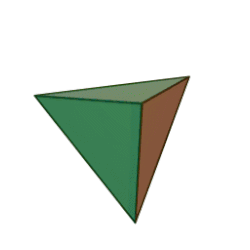 | 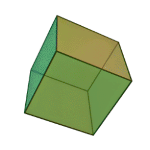 | 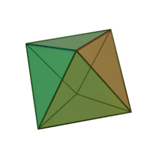 | 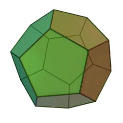 | 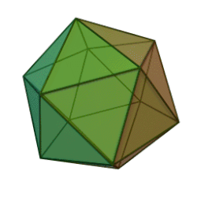 |
| 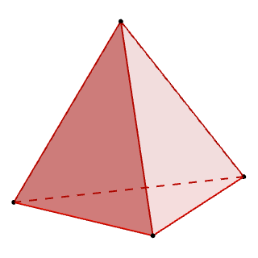   | 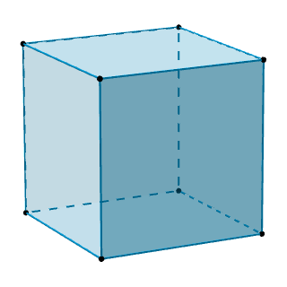       | 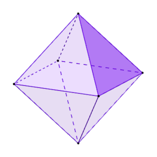   | 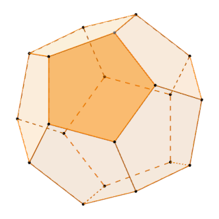   | 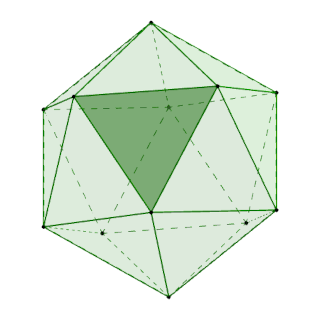   |

Le caratteristiche di un Solido Platonico, garantiscono una perfetta simmetria tra le varie facce, garantendo che nessuna faccia abbia una probabilità *fisica* si avere un vantaggio/svantaggio rispetto alle altre in caso di rotolamento. 
Per questo motivo, da questi solidi, derivano i dadi che utilizziamo comunemente.
Quello a 6 facce è quello universalmente più diffuso; gli altri, invece, sono meno diffusi, ma molto utilizzati nei [GdR](https://it.wikipedia.org/wiki/Gioco_di_ruolo) (giochi di ruolo).

| D4                        | D6                        | D8                        | D12                         | D20                         |
| --------------------------- | --------------------------- | --------------------------- | ----------------------------- | ----------------------------- |
| 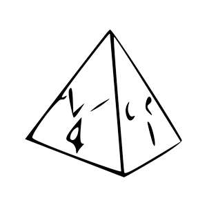 | 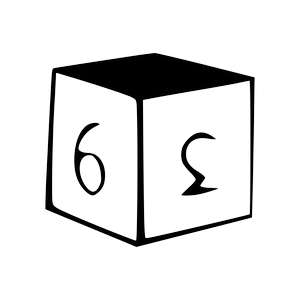 | 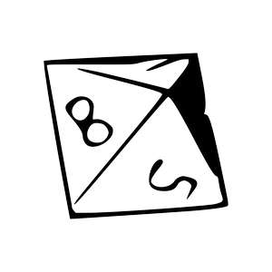 | 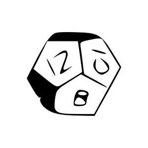 | 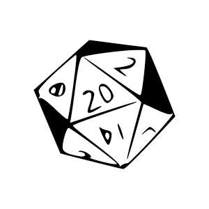 |

| Dado 10 facce                                                                                                                                                                                                                                                                                                                                                                                                                                                                                                                                                                                                                                | D10                         |
| ---------------------------------------------------------------------------------------------------------------------------------------------------------------------------------------------------------------------------------------------------------------------------------------------------------------------------------------------------------------------------------------------------------------------------------------------------------------------------------------------------------------------------------------------------------------------------------------------------------------------------------------------- | ----------------------------- |
| Da notare che nei GdR si utilizza anche un dado da 10 facce, ma sebbene le sue [:link: facce](https://it.wikipedia.org/wiki/Faccia_(geometria)) siano sovrapponibili, non sono [:link: poligoni regolari](https://it.wikipedia.org/wiki/Poligoni_regolari), e, sebbene siano [:link: congruenti](https://it.wikipedia.org/wiki/Congruenza_(geometria)), gli spigoli non hanno tutti la stessa lunghezza e di conseguenza i vertici non sono equivalenti.   Non avendo nessuno dei tre requisiti, il D10 non può essere considerato un Solido Platonico.  Nonostante questo, le facce omogenee, garantiscono una discreta euristica che per i giocatori di ruolo è sufficiente. | 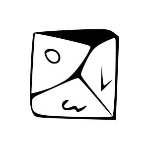 |

Le proprietà specifiche di un Solido Platonico, applicate ad un dado, garantiscono una omogeneità ai risultati pertanto una **elevata entropia**.

## il Dado a 16 facce

Questa brevissima introduzione sui Solidi Platonici, ci serve per comprendere che il D16 non è uno di questi.  
Oltretutto, a differenza del d10, non ha nemmeno le facce omogenee.

Questo si traduce in una **scarsissima entropia**, mentre a noi serve qualcosa che ci garantisca esattamente l'opposto.

Quanto descritto fino ad ora, si rispecchia perfettamente nei test che ho effettuato.  Sebbene per il momento il quantitativo di lanci su cui ho basato la mia analisi sia esiguo, già si identificano le prime devianze nei risultati.  In futuro riporterò quì i test che ho eseguito con il d16; per il momento ho inserito un link ad un documento preliminare nella sezione [Prossimamente](#prossimamente).

## Dadi Bilanciati
Cos'è un dado bilanciato e perché è così importante?  
Un dado bilanciato è un dado che assicura ad ogni faccia la stessa probabilità di uscita. Questa prerogativa implica una elevata **entropia** 
Ideologicamente, questo è quello che ci aspetteremmo da ogni dato, ma, all'atto pratico, non è così.

Esiste tutta una serie di dadi bilanciati. Si tratta dei **dadi a 6 facce** che si utilizzano nei tavoli da gioco dei casinò.  
Questi dadi sono generati con materiali qualitativamente superiori e sono certificati per questo tipo di giochi d'azzardo.  
Questi oggetti dall'aspetto banale, hanno dei costi decisamente importanti.   Di seguito vi riporto alcuni esempi di dadi più o meno bilanciati:
* Partiamo con un dado di qualità.   Non è dichiarato come bilanciato, ma è sicuramente ben fatto e molto curato:
  * Dal Negro, Dadi Puntati color avorio: [:link: amazon.it](https://amzn.to/4pE0uLL)
* Vediamo ora un altro dado di qualità, ma anch'esso senza qualifica di *calibrato*:
  * Dadi da Casinò Blu: [:link: amazon.it](https://amzn.to/3MyJvMu)
* Un altro set di dadi da casinò:
  * Dadi grado AAA con bordi a rasoio: [:link: amazon.it](https://amzn.to/4iZ0yDj)
* Finiamo con i dadi calibrati di **Gravity Dice** di cui vi lascio anche il sito: [:link: gravitydice.com](https://store.gravitydice.com/)
  * Ultra Pro Gravity Dice: [:link: amazon.it](https://amzn.to/4q6PA1M)
  * Vi prego di notare che solo i d6 vengono definiti calibrati e nelle specifiche dei d6 possiamo leggere:
    * Ogni dado è lavorato in alluminio di alta qualità;
    * ogni pip è praticato con una profondità calcolata per assicurare di una perfetta bilanciatura al dado.

Cosa si può fare per non affrontare simili costi?

Di seguito alcuni suggerimenti per capire se un dado è, quantomeno in apparenza bilanciato:

1. Forma:
   * La forma del dado è simmetrica?
   * Ci sono difformità o imperfezioni evidenti?
2. Distribuzione del peso:
   * Tenendo il dado in mano, sembrano esserci lati più pesanti?
   * Facendo rotolare in mano il dado, si sentono differenze di peso?
3. Qualità della superficie:
   * Ad una ispezione visiva, risultano irregolarità?
   * Ci sono eventuali ammaccature ad angoli o bordi?

Queste sono semplici linee guida per verificare il bilanciamento di un dado.  
Il **dado da 16 facce**, *non può superare il primo punto* visto che, avendo facce differenti tra di loro, non può risultare simmetrico, pertanto **non può in nessun modo essere definito bilanciato** e nemmeno un Solido Platonico.

Esistono test pratici per verificare se un dado è bilanciato, ma vengono descritti in un [:link: altro documento](test_bilanciamento.md).
##### NOTA BENE :bangbang:
Per creare un dado bilanciato, è necessario calcolare la profondità di ogni pip per garantire un perfetto bilanciamento del dado, ed è per questo che i costi sono elevati.  
Controllando le pagine di **Gravity Dice**, dichiarano come perfettamente bilanciati **solo i d6 !!**. Tutti gli altri sono bellissimi dadi in alluminio areonautico, ma senza nessuna prerogativa di bilanciamento.

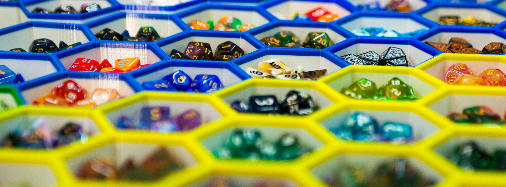

## Che dadi usare per generare una SeedPhrase?

Arriviamo ora ad affrontare quello che veramente ci interessa! Che dadi utilizzare per generare un SeedPhrase?

Rimane sempre possibile utilizzare delle monete, ma volendo utilizzare dei dadi, allora, è indispensabile utilizzare un **Solido Platonico** il più possibile bilanciato per avere una adeguata entropia.

Proprio per questo motivo, **BISOGNA RIGOROSAMENTE ESCLUDERE IL DADO DA 16 FACCE!!**.   Non mi importa assolutamente che alcune guide li raccomandino, vi ho fornito molte informazioni su cui ragionare.  Spero che possiate facilmente giungere alla mia stessa conclusione ed **evitare di creare una SeedPhrase con una bassissima entropia**.

A questo punto, che dadi possiamo usare? 
la risposta banale è: *un Solido Platonico ben bilanciato*, ma proviamo ad analizzare le vaie possibilità:

* Un solo dado da 6 usando la guida redatta da *Il Leo*;
* Un qualsiasi dado basato su un Solido Platonico, usandolo per generare un numero binario.  
In questo caso bisogna decidere a priori quali facce assegnare al valore zero e quali al valore uno e poi seguire una delle numerose guide (come quella di Turtlecute);
* Un set composto da 4 dadi: **un dado da 4 e tre dadi da 8**.

Ora vi spiego perché questo set di 4 dadi va bene, mentre il set che prevede l'uso dei d16 no. 
Solamente per un morivo Geometrico, il d4 ed il d8 sono **Solidi Platonici**, mentre il d16, no!!

*Se il d16 fosse un Solido Platonico*, sarebbe il sistema più pratico, *ma purtroppo non è così*. 
Vediamo quindi come poter generare la nostra ***maledetta* SeedPhrase**. 
Non volendo utilizzare il metodo inventato da *Il Leo*, dobbiamo generare 12 o 24 numeri compresi tra 0 e 2047. 
A questi numeri poi, corrisponderà una parola del [BIP39](#monete-o-dadi-6-facce).

Vediamo ora come possiamo scrivere il numero 2047:

* **111 1111 1111 in binario**:
  * possiamo ottenere questo valore con 11 monete o con 11 dadi;
* **3777 in ottale**:
  * possiamo ottenere questo valore con un d4 e tre d8;
* **7FF in esadecimale**:
  * ma non possiamo ottenere questo valore con un dado derivante da un **Solido Platonico**.

**Cosa conviene usare allora?**

1. Analizzando la reperibilità dei materiali necessari per generare la SeedPhrase, le 11 monete (almeno fino a che non vieteranno il contante) sono l'equipaggiamento più facile da reperire.
2. A brevissima distanza, troviamo il d6 reperibile in quasi ogni casa;  Magari non tutti ne avranno 11, ma almeno uno credo di sí.
3. Un sistema più pratico, invece, è quello di usare il set composto da un d4 e da tre d8. 
   Questi dadi sono sì particolari, ma facilmente reperibili in tutte le case di un giocatore di GdR o in un qualsivoglia negozio di giochi.
4. Come **soluzione da scartare**, invece, troviamo i d16. 
   Oltre a tutto quello che vi ho detto su questi dadi (non sono Solidi Platonici e pertanto non possono nemmeno essere Bilanciati), vi riporto la descrizione ne che fece il mio fidato negoziante: "*una cinesata inventata da Temu o piattaforme simili*".

---

### ***Conclusione***

#### Spero di avervi fornito sufficienti elementi per farvi desistere dal generare la vostra Seed Phrase utilizzando dadi a 16 facce.   Nel caso lo aveste fatto in passato, vi consiglio caldamente di generare una nuova SeedPhrase con un dado migliore.   Diffondete questa guida per far comprendere a tutti la pericolosità derivante dall'uso di un d16.  Non stiamo giocando ad un GdR, ma sono in ballo i vostri averi. Non rischiate di mancare colpire un nemico immaginario, ma **state mettendo a rischio i vostri fondi**

---

---

#### Prossimamente:

* Seguirà una veloce guida su come generare la SeedPhrase in ottale (con il d4 + 3 d8); 
  Per il momento vi lascio la tabella del BIP39 con i valori decimali, binari ed ottali: [BIP39 Octal](assets/BIP39_oct.pdf); 
* Un amico dovrebbe pubblicare il codice per generare il checksum sia dalle 11 (o 23) parole (dando quindi scelte multiple), ma anche generando con i dadi la prima metà dell'ultima parola; 
* Pubblicherò poi le mi prove fatte con il d16; che per il momento potete leggere in [questo PDF preliminare](assets/D16.pdf).  A proposito di questo documento, devo però dirvi:
  * Non avevo ancora fatto collegamento ai solidi platonici;
  * Ho effettuato "*solo*" 384 lanci ed il lancio **75** riporta un valore errato;
  * Non ho ancora redatto le conclusioni matematiche.

---

*... stay tuned ...*

---
