# SeedPhrase, Dadi e **Security Tradeoff**

### Chiunque si sia dimostrato interessato a Bitcoin, prima o poi ha dovuto affrontare la generazione di una SeedPhrase.

Ci sono svariati metodi per generare questa serie di 12 o 24 parole, ma ognuno ha differenti livelli di entropia e, di conseguenza, differenti livelli di sicurezza. 
Una volta generata la SeedPhrase, sarà poi necessario conservarla in maniera sicura, ma questo è un argomento che non verrà toccato in questo testo.

# Generazione SeedPhrase con i dadi

Uno dei principali metodi che vengono indicati per la generazione con elevata entropia prevede l'utilizzo dei dadi. 
Quì non verrà illustrato un nuovo metodo per generare una SeedPhrase, ma semplicemente descriverò alcune personali considerazioni.

### Monete o Dadi 6 facce

Come sapete, per descrivere in maniera binaria il numero corrispondente alle 2048 parole introdotte con il [:link: BIP39](https://github.com/bitcoin/bips/tree/master/bip-0039), servono 11 bit, per questo motivo vengono spesso utilizzati, per la generazione della SeedPhrase, 11 monete oppure 11 dadi; generalmente dadi a 6 facce (d6).

Se non conoscete questa tecnica per la generazione della SeedPhrase, vi consiglio di leggere la guida redatta da [:link: Turtlecute](https://github.com/Turtlecute33) e pubblicata su suo sito: [:link: turtlecute.org/seed](https://turtlecute.org/seed/). La stessa procedura può essere utilizzata utilizzando 11 monete.

Ho appositamente menzionato le monete, perché ritengo che possa essere più semplice recuperare 11 monete identiche piuttosto che 11 dadi. 
E' anche vero che si può utilizzare un solo dado e lanciarlo 11 volte per ogni parola da generare, ma la procedura risulterà molto più lunga.

A questo proposito, però, vi segnalo un metodo che ha ideato **Il Leo** e che permette di generare la SeedPhrase lanciando un solo dado da 6, un numero limitato di volte. 
La guida pubblicata da **Il Leo** è stata presenta allo *Spazio21 di Lugano* nel 2025.  
Se vi siete persi il suo speech, potrete trovare la sua guida su questo gruppo Telegram: [:link: ABC del ₿itcoin](https://t.me/+GlEaD0WD53BmNGE0) e interagire con lui per qualsiasi domanda.

---

### Altri tipi di Dadi

Mi è capitato di imbattermi in guide che esortano gli utenti ad utilizzare altri tipi di dadi, ad esempio una indicava di usare un dado da 20 facce (d20) e un dado da 100 facce. In realtà, i 100 numeri erano generati con 2 dadi da 10 facce (d10). 
Ma la maggior parte delle guide che prevedono l'utilizzo di dadi differenti dal d6, si basano sull'utilizzo di **dadi da 16 facce** (d16) :interrobang: ***dadi da 16 facce*** :interrobang:

Ho iniziato a giocare a **D&D** (il più famoso [GdR](https://it.wikipedia.org/wiki/Gioco_di_ruolo)) parecchi lustri fa. Dopo D&D ho provato molti altri GdR ed in tutti si usavano svariati dadi, ma mai un d16. 
Infatti quasi cascai dalla sedia quando sentii nominare i ***d16***.

* :bangbang: Mai sentiti;
* :bangbang: Mai utilizzati;
* :bangbang: Mai visti in nessun negozio e nessuna fiera.

Ho contattato tutti i miei conoscenti: giocatori, [:link: game master](https://it.wikipedia.org/wiki/Game_master) ed anche commercianti, ma **nessuno conosceva questo dado**.

Così, pieno di curiosità e aspettative, ho acquistato (*leggete tutto prima di valutarne l'acquisto :shit:*) [:link: questi dadi](https://amzn.to/48HkGFp) da 16 facce su Amazon. 
All'arrivo ho subito notato che le 16 facce non erano tutte uguali, anzi, erano presenti 3 tipi di facce distinte e **nessuna** di queste aveva una **forma geometriche REGOLARE**.

|                                          |                                          |
| :----------------------------------------- | ------------------------------------------ |
| 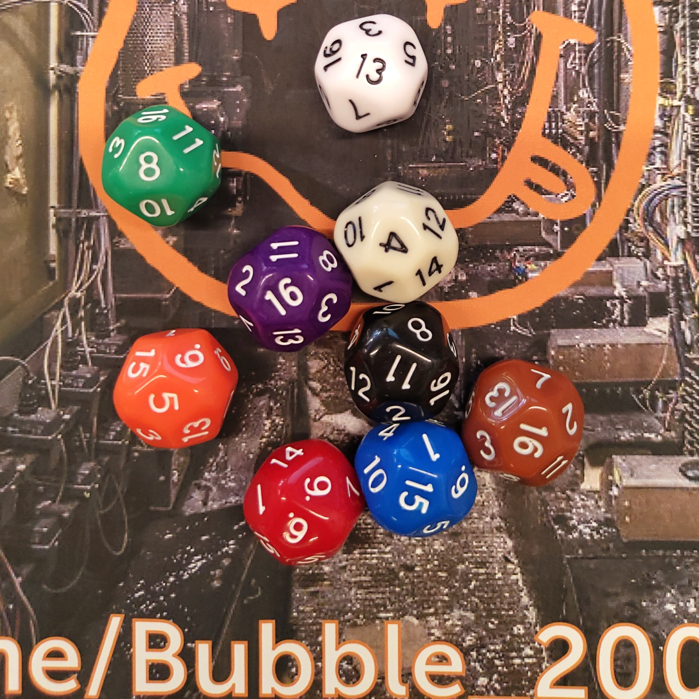 | 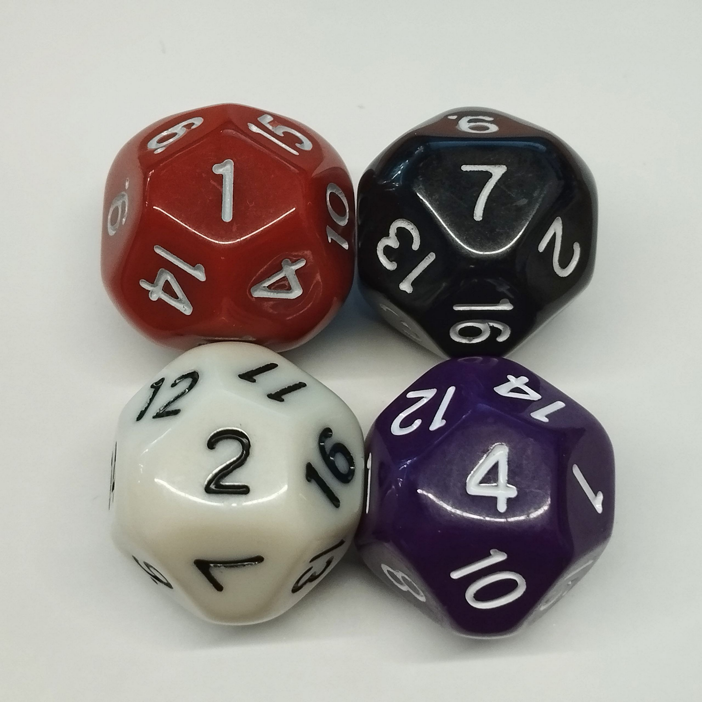 |

Nel rispetto della filosofia *"don't trust, verify"*, ho analizzato la situazione ed ecco quanto è emerso.

Inizialmente mi sono documentato sull'origine dei dadi e mi sono imbattuto in una informazione che durante i miei lontani studi di Geometria, non avevo fissato nella mia memoria: **I Solidi Platonici**. 
Visto l'importanza di questo argomento ne faccio un breve accenno di seguito:

## I Solidi Platonici

**Platone**, insieme al suo maestro **Socrate** e al suo allevo **Aristotele** ha posto le basi del *pensiero filosofico occidentale*. 
La rilevanza tra un filosofo e la geometria, a noi non interessa, quello che invece è fondamentale è capire i requisiti di un **Solido Platonico** e perché queste sue *caratteristiche di regolarità* sono molto importanti in questo contesto.

Il **solido platonico**, sinonimo di **solido regolare** e di **poliedro convesso regolare**, indica un [:link: poliedro convesso](https://it.wikipedia.org/wiki/Poliedro_convesso) con le seguenti caratteristiche:

* le sue [:link: facce](https://it.wikipedia.org/wiki/Faccia_(geometria)) hanno tutte la stessa superficie, essendo [:link: poligoni regolari](https://it.wikipedia.org/wiki/Poligoni_regolari) [:link: congruenti](https://it.wikipedia.org/wiki/Congruenza_(geometria)) (cioè esattamente sovrapponibili);
* i suoi [:link: spigoli](https://it.wikipedia.org/wiki/Spigolo) hanno tutti la stessa lunghezza;
* i suoi [:link: vertici](https://it.wikipedia.org/wiki/Vertice_(geometria)) sono tutti equivalenti, sicché i suoi [:link: angoloidi](https://it.wikipedia.org/wiki/Angoloide) (angoli interni tridimensionali) hanno tutti la stessa ampiezza.

Esistono **soltanto cinque solidi** con queste caratteristiche e sono:

| Tetraedro                            | Esaedro                           | Ottaedro                           | Dodecaedro                             | Icosaedro                            |
| -------------------------------------- | ----------------------------------- | ------------------------------------ | ---------------------------------------- | -------------------------------------- |
|  |  |  |  |  |
|    |        |    |    |    |

Le caratteristiche di un Solido Platonico, garantiscono una perfetta simmetria tra le varie facce, garantendo che nessuna abbia una probabilità *fisica* si avere un vantaggio/svantaggio rispetto alle altre in caso di rotolamento. 
Per questo motivo, da questi solidi, derivano i dadi che utilizziamo comunemente.
Quello a 6 facce è quello universalmente più diffuso; gli altri, invece, sono meno diffusi, ma molto utilizzati nei [:link: GdR](https://it.wikipedia.org/wiki/Gioco_di_ruolo) (giochi di ruolo).

| D4                        | D6                        | D8                        | D12                         | D20                         |
| --------------------------- | --------------------------- | --------------------------- | ----------------------------- | ----------------------------- |
|  |  |  |  |  |

| Dado 10 facce                                                                                                                                                                                                                                                                                                                                                                                                                                                                                                                                                                                                                                                                                                                                                                                 | D10                                                                                       |
| ----------------------------------------------------------------------------------------------------------------------------------------------------------------------------------------------------------------------------------------------------------------------------------------------------------------------------------------------------------------------------------------------------------------------------------------------------------------------------------------------------------------------------------------------------------------------------------------------------------------------------------------------------------------------------------------------------------------------------------------------------------------------------------------------- | ------------------------------------------------------------------------------------------- |
| Da notare che nei GdR si utilizza anche un dado da 10 facce, ma sebbene le sue[:link: facce](https://it.wikipedia.org/wiki/Faccia_(geometria)) siano sovrapponibili, non sono [:link: poligoni regolari](https://it.wikipedia.org/wiki/Poligoni_regolari), e, sebbene siano [:link: congruenti](https://it.wikipedia.org/wiki/Congruenza_(geometria)), gli spigoli non hanno tutti la stessa lunghezza e di conseguenza i vertici non sono equivalenti.  Non avendo nessuno dei tre requisiti, il D10 **non può** essere considerato un Solido Platonico.  Nonostante questo, viene largamente utilizzato, forse perchè le facce omogenee dovrebbero una discreta euristica che per i giocatori di ruolo è sufficiente.  Le sue 10 facce hanno una forma che ricorda un aquilone. |   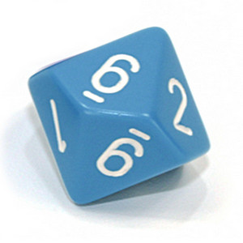 |

#### Qual'è la correlazione tra Solidi platonici e dadi ?

Le proprietà specifiche di un **Solido Platonico** applicate ad un dado, garantiscono una omogeneità ai risultati presentando una **elevata entropia**.

## il mio Dado a 16 facce

Questa brevissima introduzione sui Solidi Platonici, ci serve per comprendere che il **D16 da me acquistao**, non è compreso tra essi. 
Oltretutto, a differenza del d10, le sue facce non sono nemmeno omogenee.

Tutto questo si traduce in una **scarsissima entropia**, peranto andrebbe assolutamente sconislgiato per un utilizzo in cui l'eltropia è fondamentale.

Per conoscenza, vi lascio il collegamento alla pagina di
**Dice Collecting Wiki** inerente al [:link: d16](https://dice.miraheze.org/wiki/D16). Potrete notare come vi siano molteplici forme con cui è stato realizzato il dado da 16 facce, ma **nessuna di questa è riconducibile ad un Solido Platonico**.

Per valutare questa scarsissima entropia, ho effettuato una serie di lanci di test che verranno illustrati di seguito.

## Strani Dadi

I GdR sono così diffusi e così antichi che i produttori di dadi hanno creato cose fantasiose per poter continuare a vendere.

Non è quindi insolito, imbattersi in dadi con una quantitativo di facce che rientrano nella serie dei Solidi Platonici, ma con forme strambe come quelli in foto quì sotto.

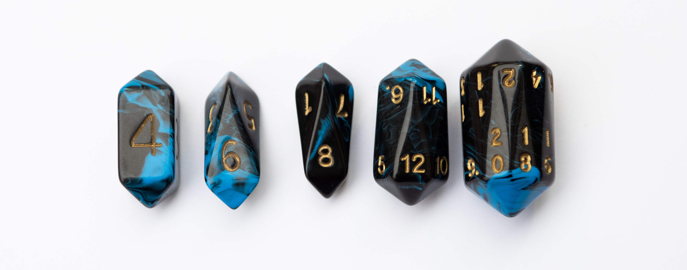

Qualle che verrà descritto sotto, non riguarda questi dadi. Verranno pertano presi in considerazione solantao dadi **normali**, ovvero riconducibili ad un Solido Platonico.

## Dadi Bilanciati

Cos'è un dado bilanciato e perché è così importante?  
Un dado bilanciato è un dado che assicura ad ogni faccia la stessa probabilità di uscita. Questa prerogativa è la base per una elevata **entropia**. 
Ideologicamente, questo è quello che ci aspetteremmo da ogni dado, ma, come vedremo, non è così.

Esiste tutta una serie di **dadi bilanciati**; si tratta principalmente **dadi a 6 facce** che si utilizzano principalmente nei tavoli da gioco dei casinò.  
Questi dadi sono prodotti con materiali qualitativamente superiori e sono certificati per l'utilizzo in giochi d'azzardo.  
Questi oggetti dall'aspetto banale, però, hanno dei costi decisamente importanti.  Di seguito vi riporto alcuni esempi di dadi più o meno bilanciati:

* Partiamo con un dado di qualità.   Non è dichiarato come bilanciato, ma è sicuramente ben fatto e molto curato:
  * Dal Negro, Dadi Puntati color avorio: [:link: amazon.it](https://amzn.to/4pE0uLL)
* Vediamo ora un altro dado di qualità, ma anch'esso senza qualifica di *calibrato*:
  * Dadi da Casinò Blu: [:link: amazon.it](https://amzn.to/3MyJvMu)
* Un altro set di dadi da casinò:
  * Dadi grado AAA con bordi a rasoio: [:link: amazon.it](https://amzn.to/4iZ0yDj)
* Finiamo con i dadi calibrati di **Gravity Dice** di cui vi lascio anche il sito: [:link: gravitydice.com](https://store.gravitydice.com/)
  * Ultra Pro Gravity Dice: [:link: amazon.it](https://amzn.to/4q6PA1M)
  * Vi prego di notare che solo i d6 vengono definiti calibrati e nelle specifiche dei d6 possiamo leggere:
    * Ogni dado è lavorato in alluminio di alta qualità;
    * ogni pip è praticato con una profondità calcolata per assicurare di una perfetta bilanciatura al dado.

Cosa si può fare per non affrontare simili costi?

Di seguito alcuni suggerimenti per capire se un dado (anche uno normale e non da 6 facce) è, quantomeno in apparenza bilanciato:

1. Forma:
   * La forma del dado è simmetrica? (è un solido platonico?)
   * Ci sono difformità o imperfezioni evidenti?
2. Distribuzione del peso:
   * Tenendo il dado in mano, sembrano esserci lati più pesanti?
   * Facendo rotolare in mano il dado, si sentono differenze di peso?
3. Qualità della superficie:
   * Ad una ispezione visiva, risultano irregolarità?
   * Ci sono eventuali ammaccature ad angoli o bordi?

Queste sono semplici linee guida per una veloce verifica per intuire il bilanciamento di un dado.  
Il **dado da 16 facce** da me acquistato, *non può superare il primo punto* visto che, avendo facce differenti tra di loro, non può risultare simmetrico, quindi, quindi non può in nessun modo essere definito bilanciato** e tantomeno un Solido Platonico.

Esistono test pratici per verificare se un dado è bilanciato, ma vengono descritti in un [:link: altro documento](test_bilanciamento.md).

##### NOTA BENE :bangbang:

Leggendo la descrizione fatta sul loro sito da Gravity Dice, per creare un **dado bilanciato**, è necessario realizzare ogni pip di una profondità specifica per garantire un perfetto bilanciamento del dado; questa lavorazione di precisione grava sul costo di questo prodotto.  
Per questo motivo, la **Gravity Dice**, dichiara come perfettamente bilanciati **solo i d6 !!**. Tutti gli altri sono bellissimi dadi in alluminio areonautico, ma senza nessuna prerogativa di bilanciamento.  Se una azienda specializzata a produrre dadi bilanciati, produce dolo d6 con queste caratteristiche, credo sia molto difficile, se non impossibile, trovare dadi con certificazione di blilanciamento con un numero di facce differenti da 6.

## Che dadi usare per generare una SeedPhrase?

Arriviamo ora ad affrontare quello che veramente ci interessa!  **Che dadi utilizzare per generare un SeedPhrase**?

In seguito alle mie preoccupanti scoperte sul d16, ho iniziato a parlarne in rete. 
La reazione del network è stata di scherno, ridicolizzazione del mio lavoro. Oltre a questi ed altri spiacevoli avvenimenti, sono stato informato che esiste anche un altro tipo di dado da 16 facce, cosa che da una prima, una seconda ed anche una terza ricerca non era emersa.

Questa chimera a 16 facce, ho avuto estrema difficoltà reperirlo, ma alla fine, acquistato un set di dadi per il gioco Warhammer.  
Nello specifico il [:link: set di dadi di Blood Bowl](https://www.warhammer.com/it-IT/shop/Blood-Bowl-Dice-Set-2019).

|                                           |                                           |                                           |
| :------------------------------------------: | :------------------------------------------: | :------------------------------------------: |
| 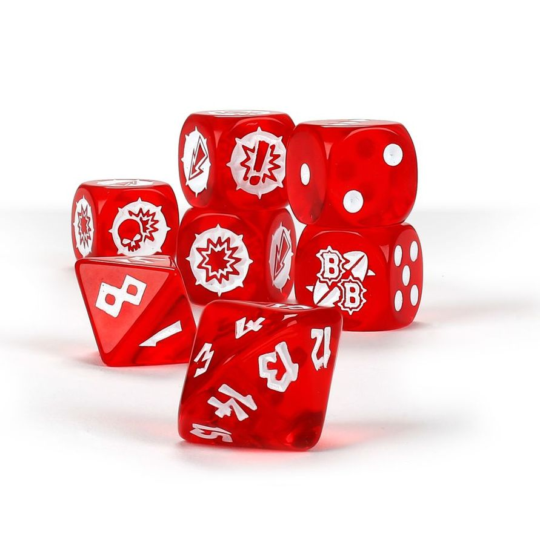 | 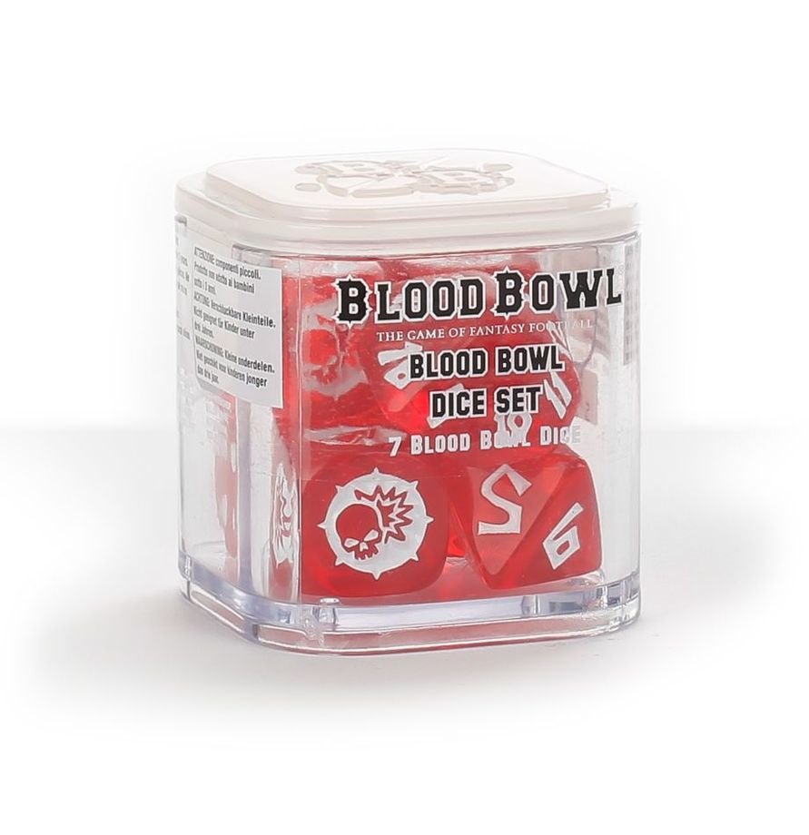 | 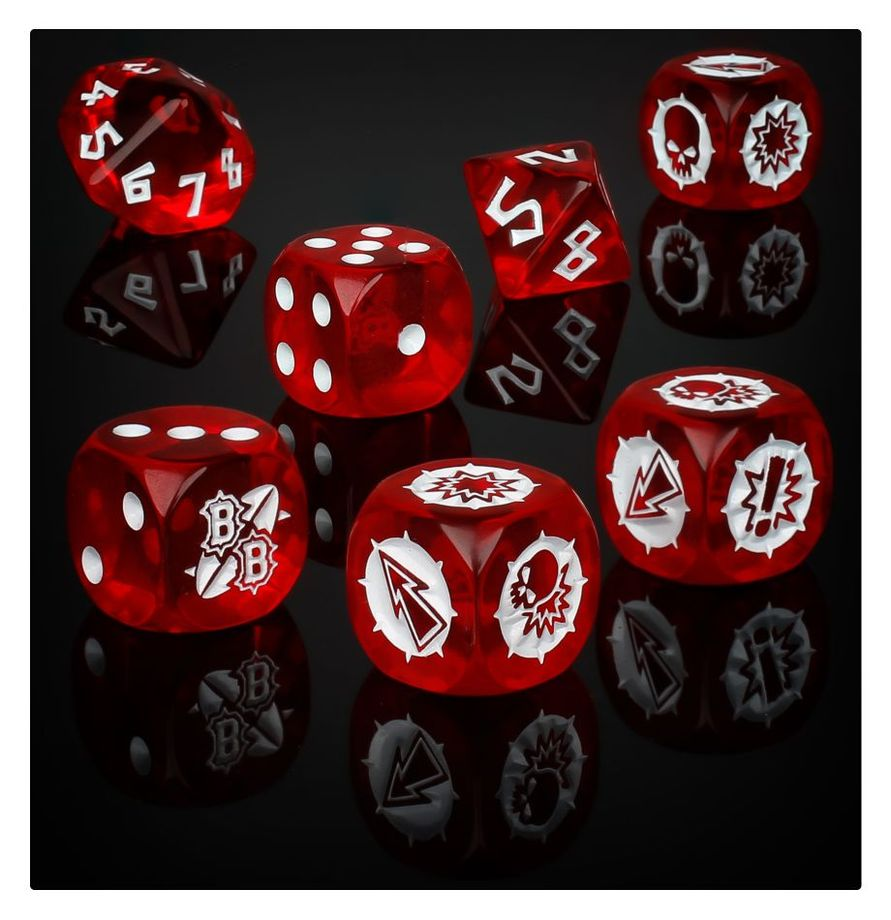 |

Dopo essere venuto a conoscenza di questa tipologia di dadi, ho provato a scrivere ad alcuni autori di guide che prevedono al generazione della Seed Phrase con il lancio di dadi a 16 facce, ma ho incontrato un muro di invadente ostilità. 
Scrissi anche un tizio italiano a cui avevo suggerito, rispondendo ad un tuo post su X (fu Twitter), di inserire un disclaimer sulla tipologia di dado da utilizzare per seguire la sua guida, mi ha prima perculato su Telegram e poi bloccato su X. 

|                                 |                           |
| :-------------------------------: | :--------------------------: |
| 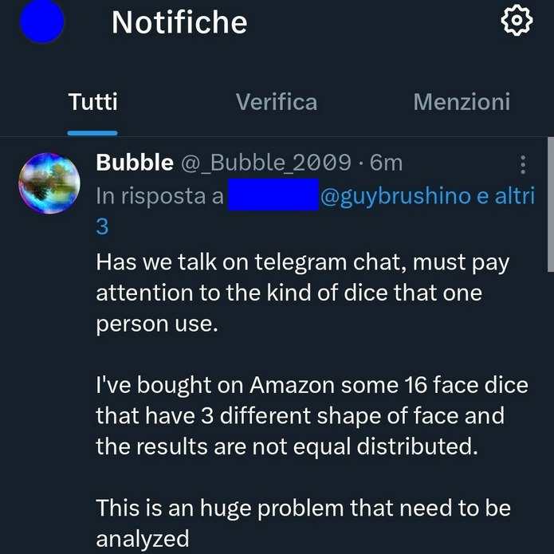 |  |

Di recente ho pubblicato questa citazione:

 

Ma vale solo per le persone con una mentalità aperta, persone aperte al dialogo, persone con cui ci si puà interfacciare per costruire qualcosa. 
In questo frangente, invece, ho trovato solo gente che rifiutava un dialogo costruttivo.

Questo dado, comunque, non mi convinceva, così ho deciso di cercarlo. 
Ammetto che non è stato facile reperirlo perchè, appena appreso della sua esistenza, sul sito Warhammer questo set era esaurito ed altrove erano disponibili solo con consti molto elevati.

Una volta recuperati i dadi, ho effettuato un primo esame visivo sul d16. 
Di seguito potete vedere le foto in cui risulta evidente quanto sotto descritto:

|                                       |                                       |                                       |                                       |                                       |
| :-------------------------------------: | :-------------------------------------: | :-------------------------------------: | :-------------------------------------: | :-------------------------------------: |
| 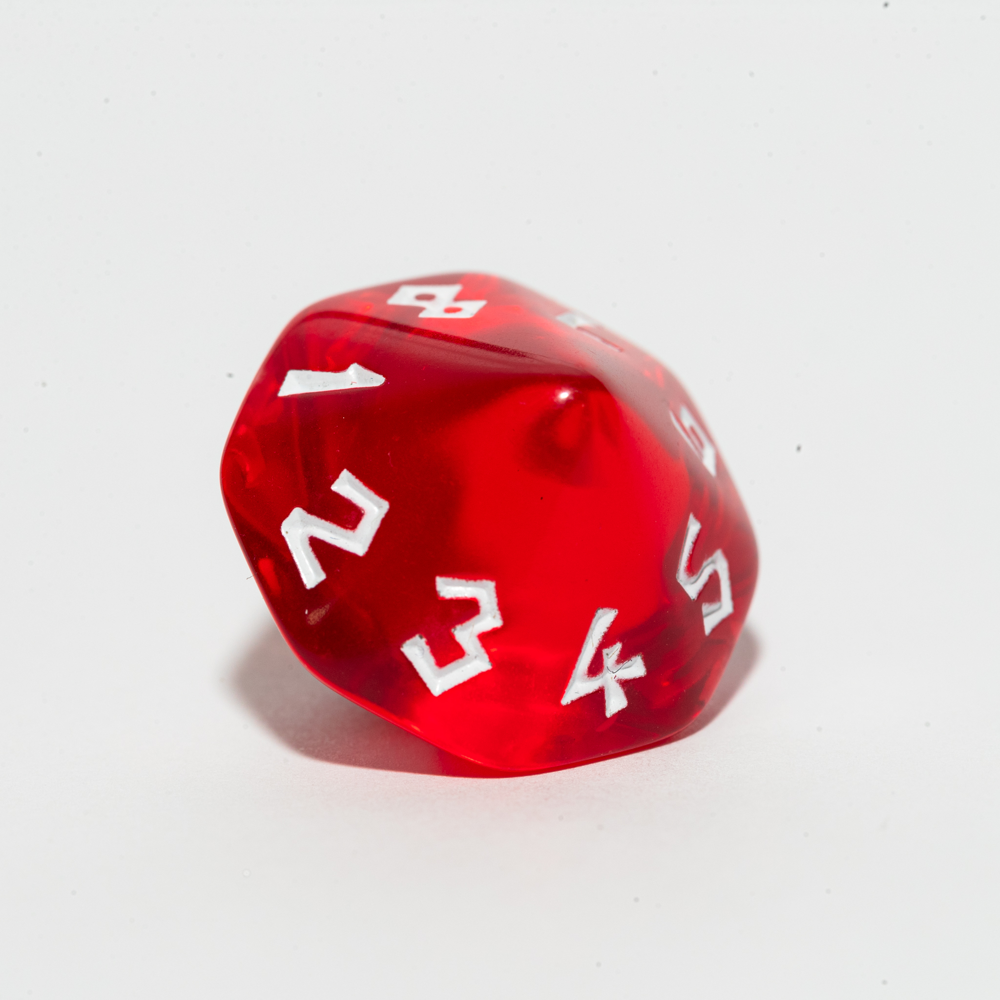 | 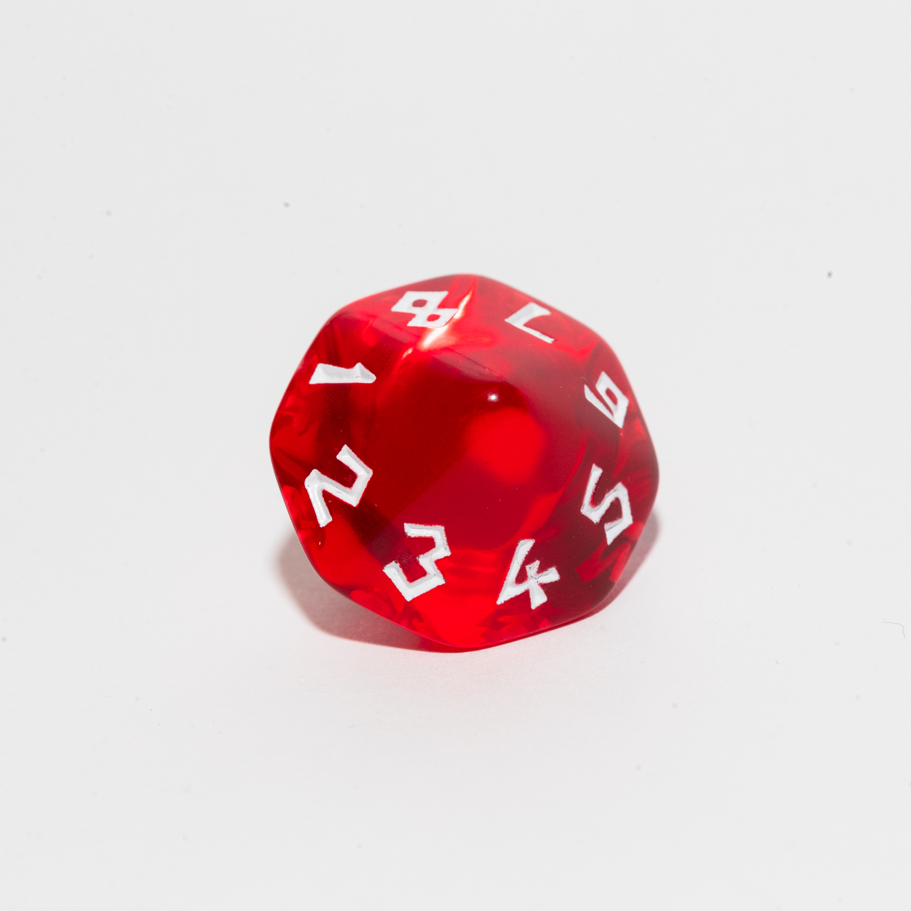 | 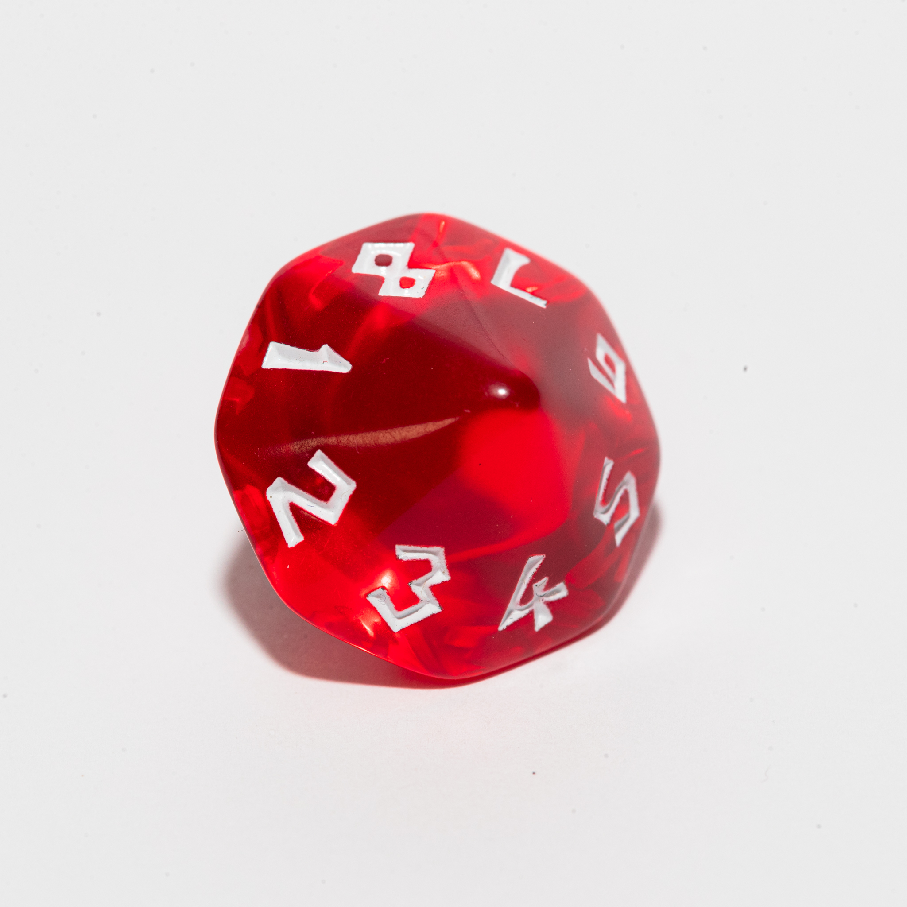 | 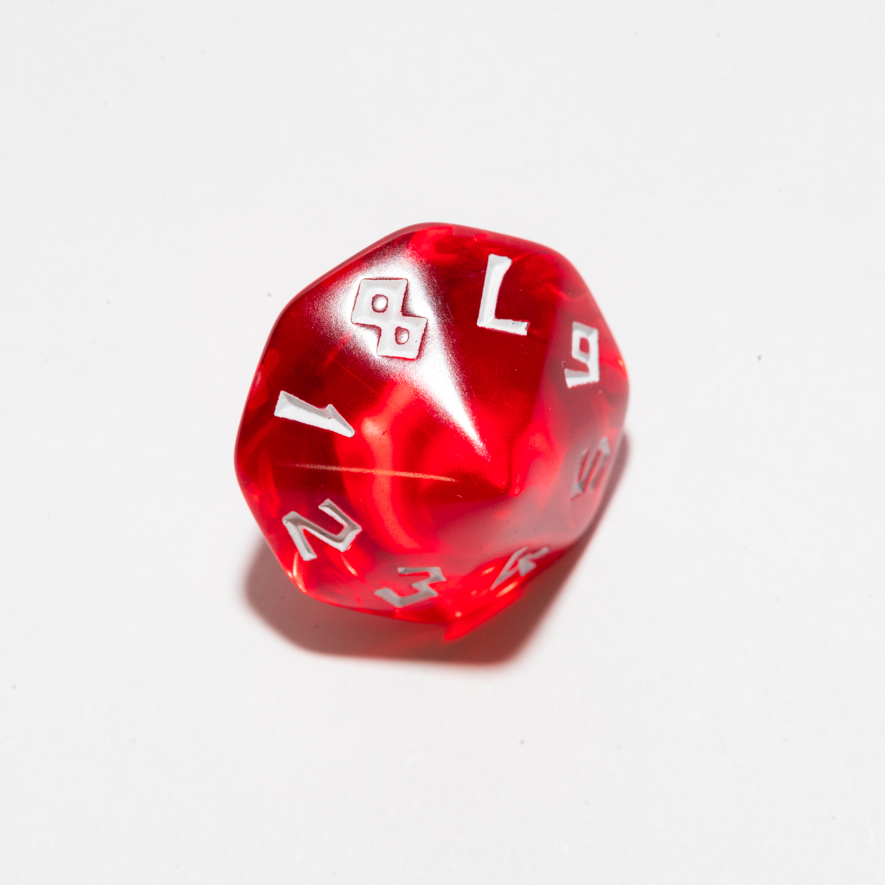 | 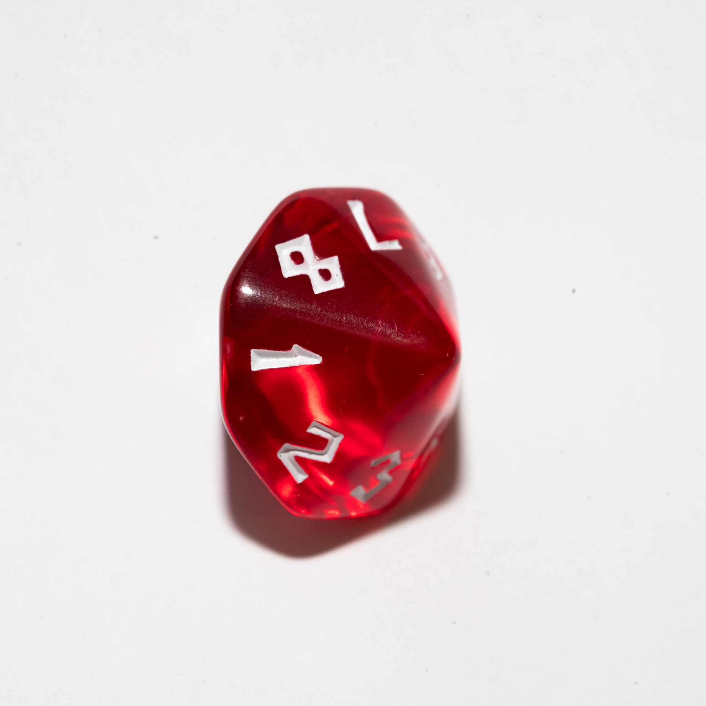 |

Risulta subito visibile che questo dado **NON E' UN SOLIDO PLATONICO** perchè, pur avendo le facce congruenti, la loro forma non è quella di un poligono regolare; gli spigoli non hanno tutti la stessa lunghezza ed oltretutto sono molto arrotondati.

Dai primi lanci effettuati per curiosità, ho notato che gli spigoli arrotondati, tendevano a far cambiare faccia al dado fino all'ultimo e le ridotte dimensioni delle facce, lo rendevano poco stabile, pertanto, anche con minime vibrazioni del piano, la faccia variava.

Per giungere ad un dunque di questa mia indagine, ho deciso di effettuare una serie di lanci con alcuni dadi, annotando i risultati. 
Lanci, calcoli e descrizione del metodo sono riportati in [questa pagina](./DataAnalysis.md). 
Come visibile, mi sono concentrato solo sui due tipi di d16 e sui d8. 
Perchè i d8? 
Cercavo una alternativa al d16, ma che fosse un dado platonico. Il d8 poteva essere una proposta che ci permetteva di effettuare molti meno lanci del d6 ed essendo platonico, aveva migliori change di coerenza nei risultati.

In seguito alla [Analisi dei dati](./DataAnalysis.md) che ho effettuato, io mi sento di **sconsigliare l'uso di un dado da 16 facce** ed anche di un qualsiasi dado proveniente da quello specifico set di dadi. 
Escludendo il dado da 8 facce proveniente dal set di Warhammer, tutti gli altri hanno offerto risultati che danno da un po' migliori fino ad incredibilmente migliori.

**Cosa conviene usare allora?**  *Analizziamo i dati:*

* **d16** dado da 16 facce;
  * sconsigliati sia per la difficile reperibilità, sia per gli scarsi risultati ottenuti;
* **d8** dado da 8 facce;
  * a parte uno decisamente sfigato, i risultati sono tra il buono ed il promettente;
  * sono facilmente reperibili nei negozi che trattano GdR o similari;
* **d6** dado da 6 facce;
  * sono facilmente reperibili ovunque (anche supermercati, tabaccai, etc etc);
  * trovate tantissimi guide convenzionali che vi aiutato a creare una guida usando questi dadi (vedi ad esempio la guida di *Turtlecute*);
  * con un singolo dado e pochi lanci potete generare una Seed Phrase (vedi la guida creata da *il Leo*);
  * ammetto, però, di non averli ancora testati, magari prossimamente aggiungerò alla guida qualche lancio di d6 come completamento;
* **monete**
  * io appoggio anche questo tipo di generazione della seed, ma consiglio di cercare 11 monete uguali, il più nuove possibile per evitare che una eventuale erosione data dall'utilizzo possa alterare i risultati.

  ## ***Conclusione***

  E' stato un lavoro veramente arduo e stressante, devo ringraziare *mia figlia* per avermi aiutato con qualche lancio di dado, ma soprattutto *il Leo* che mi ha spronato continuamente a portare a termine questa opera.

  L'idea iniziale era di proporre una guida alternativa all'uso del d16 basata sull'utilizzo di d8 (con l'ausilio facoltativo di un d4), ma per il momento ho deciso di lasciare perdere. 
  Fatemi sapere se è di vostro interesse e ne riprenderò la sua stesura.

  Spero di avervi fornito un numero sufficiente di dati da permettervi di effettuare una scelta consapevole. 
  Questo era il mio intento, fatemi sapere le vostre opinioni. Io sono sempre aperto ad un confronto costruttivo.

  ### **Risorse**
  Ripropongo quì le risorse citate in precedenza per una più facile consultazione:
  * la mia [:link: Analisi dei dati](./DataAnalysis.md) registrati con i lanci;
  * i risultati dei [:link: lanci effettuati](./result.md)
  * La guida pubblicata da **Il Leo** che potete trovare nel nostro gruppo Telegram: [:link: ABC del ₿itcoin](https://t.me/+GlEaD0WD53BmNGE0);
  * La guida di Turtlecute [:link: per la generazione della Seed Phrase](https://turtlecute.org/seed/) utilizzando 11 dadi (applicabile anche a 11 monete).
  ---

  |                                                                                                                                                                                                                                                                                                                                                                         |                                                                 |
  | :------------------------------------------------------------------------------------------------------------------------------------------------------------------------------------------------------------------------------------------------------------------------------------------------------------------------------------------------------------------------ | :---------------------------------------------------------------: |
  | Come sempre invito chiunque voglia commentare a farlo liberamente, accetto volentieri C&C che possano arricchire e/o correggere questo scritto. Ho buttato tutto giù di getto, pertanto segnalatemi anche qualsiasi tipo di errore.   Per parlare con me di questa guida, unitevi al gruppo Telegram :link:[ABC del Bitcoin](https://t.me/+GlEaD0WD53BmNGE0). | [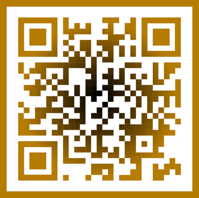](https://t.me/+GlEaD0WD53BmNGE0) |

