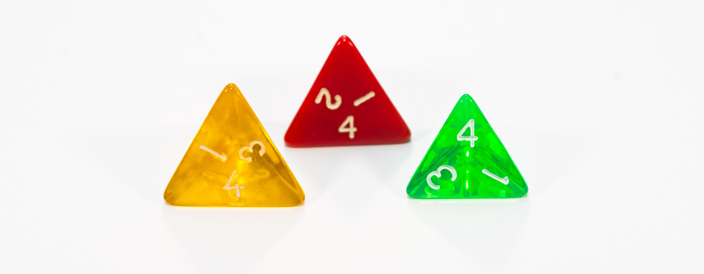
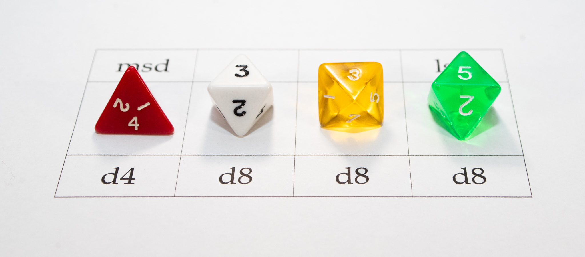
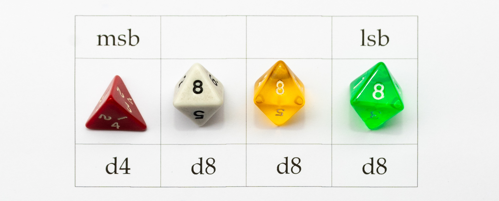
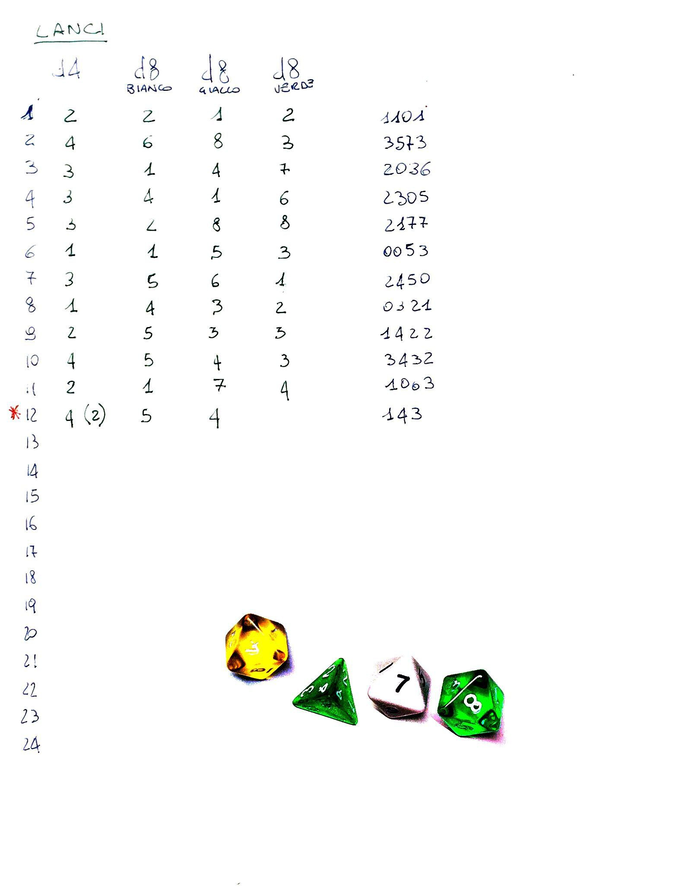
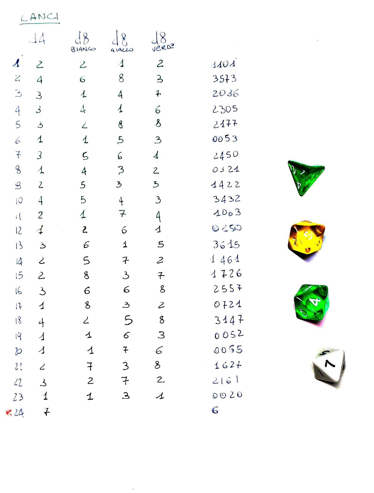

# Generazione di una SeedPhrase con d4 e d8.
Ora che vi è ben chiaro quali dadi **non usare**, vediamo come generare una SeedPhrase utilizzando dadi che derivino da Solidi Platonici.

1 Metodo "*classico*":
    * si utilizza uno d più d6 o monete;
    * si creano gli indici della parole in binario;
    * trovate la guida ben spiegata da [:link: Turtlecute](https://github.com/Turtlecute33) e pubblicata su suo sito: [:link: turtlecute.org/seed](https://turtlecute.org/seed/); 
2 Metodo "*smart*" divulgato da "***Il Leo***":
    * si utilizza un solo d6 e lo si lancia al massimo 15 volte;
    * trovate la guida ed anche *Il Leo* su questo gruppo Telegram: [:link: ABC del ₿itcoin](https://t.me/+GlEaD0WD53BmNGE0) 
3 Metodo "*alternativo*" che vi illustro di seguito:
    * molto simile al metodo *classico*;
    * utilizza un d4 e tre d8;

Come già spiegato, il nostro intento è generare in modo entropico una serie di indici numerici compresi in un range tra 0 e 2047.  Vediamo come possiamo scrivere questi numeri:
* Decimale
    * da 0 a 2047
* Esadecimale:
    * da 0 a 7FF
* Ottale:
    * da 0 a 3777
* Binario:
    * da 0 a 11111111111

La guida *classica* genera la SeedPhrase utilizzando il codice **binario** e per ogni indice (parola) dobbiamo 11 dad1 (o monete), questa guida, invece, utilizza il sistema **ottale** consentendoci di lanciare 4 dadi per ogni indice.  

## Preparazione
Prima di procedere, dovete procurarvi un d4 e tre d8.  Vi consiglio di recuperare 3 d8 di colori differenti in modo da azzerare il fattore decisionale umano che potrebbe indebolire l'entropia.  E' vero che potete anche utilizzare un solo dado da 8 e lanciarlo 3 volte per ogni parola, ma questo aumenterebbe di molto il numero di lanci da effettuare.

Per questa guida utilizziamo di d4 ed i d8 che sono dadi derivanti da Solidi Geometrici. Vi consiglio di effettuare i test di bilanciamento spiegati in [:link: questo documento](test_bilanciamento.md). 
Se riuscirete a procurarvi questi 4 dadi, vi basterà effettuare un lancio di questo set per ogni parola. 
Oltre ai dadi vi servirà un taccuino in cui appuntarvi i risultati e poi un computer per calcolare il checksum.

### Lettura del d4

Questi tre dadi, indicano il valore 4, ma, come potete vedere, il dado giallo (poco leggibile in foto) ed il dado rosso hanno il quattro nella base, mentre quello verde ha il 4 nel vertice. 
Che io sappia, esistono solo queste due tipologie di d4, ma non escludo che possiate trovarne di differenti.

### Perché 3 dadi di colore differente?

**piccola premessa** 
in una stringa binaria, il numero più a sinistra viene chiamato **msb** (most significative bit o bit più significativo) e quello più a destra **lsb** (less significative bit o bit meno significativo). In questo caso, però non stiamo parlando di bit ma di caratteri (digit) così definiremo **msd** e **lsd** le nostre cifre agli  estremi.

Con i nostri lanci dovremo generare un numero ottale che andrà da 0000 fino a 3777 (equivalente ottale di 2047). 
Prendiamo per esempio un lancio **4335**.

Questo numero è composto da 4 caratteri: abbiamo il 4 che è il **msd**, poi il 3, ancora il 3 e finiamo con il 5 che è l'**lsd**. 

Il primo carattere verrà generato con il dado da 4, mentre gli altri tre, con i dadi da 8. Per massimizzare l'entropia è molto utile definire a priori quale dado da 8 fornirà il valore lsd e quali dadi gli altri due valori. 
I colori differenti servono a identificare univocamente i 3 dadi da 8 e posizionare i valori ottenuti nella apposita posizione della stringa che fornirà il valore. 
Nel mio caso, il dado verde sarà l'**lsd**, poi metterò alla sua sinistra il dado giallo e per finire il dado bianco. 
Rispettando questo codice colore, evitiamo che una decisione umana possa ridurre l'entropia.

## Esecuzione dei lanci aumentando l'entropia
Quelle che seguono, sono personali considerazioni su come aumentare l'entropia generata dal lancio dei dadi. 
Se si ripetesse esattamente lo stesso lancio, clonando alla perfezione tutti i movimenti e le condizioni del primo lancio, con molta probabilità i risultati sarebbero i medesimi. Effettuando lanci a mano, questo è pressoché impossibile, però, i consigli che seguono, potrebbero aumentare l'entropia, pertanto consiglio di seguirli.
* Cambiate tipologia di lancio ogni volta che tirate i dadi.  Quelli che seguono sono le tipologie di lanci che effettuo io, se ne individuate di differenti, fatemelo sapere che li aggiungerò. 
    * lancio da seduto con dadi in mano fatti cadere sul tavolo;
    * lancio da in piedi con i dadi in mano fatti cadere sul tavolo;
    * dadi inseriti in un bicchiere ti plastica dura capiente, magari con anche qualche dado in più (che non userete nel risultato) fatti cadere sul tavolo;
    * le precedenti tipologie di lanci, ma facendo cadere i dadi per terra;
* Non abbiate fretta di terminare tutti i lanci: prendetevi delle pause dopo qualche lancio;
* Decidendo a priori una metrica per validare i lanci *buoni*, effettuate molti più lanci del dovuto (ad esempio il doppio dei lanci valutandone *buono* no si ed uno no).

Decidete come effettuare i lanci ed eseguite l'operazione fino ad avere:
* 11 lanci validi[^1] per creare una SeedPhrase da 12 parole
* 23 lanci validi[^1] per creare una SeedPhrase da 24 parole

E' però necessario eseguire una semplicissima operazione matematica annotandosi i risultati.
Potete decidere se farlo subito, oppure se farlo dopo per tutti i risultati. 
In pratica, bisogna sottrarre uno al valore di ogni dado. Tornando all'esempio di prima:

Il valore 4335 dovrà esse trascritto in bella come 3224.<bs>
Va compiuta questa operazione per generare un numero ottale che prevede una numerazione da 0 a 7.

Segue un esempio di come potrebbe essere fatta la tabella di lanci. 
Vedremo nel capitolo successivo come mai i lanci per gli indici numero 12 o 24 sono differenti.

| Esempio Lanci 12 parole | Esempio Lanci 24 parole |
|---------------------------|---------------------------|
|||

## L'ultima parola
Siamo ora arrivati a dover individuare la parola del checksum.
Arrivati a questo punto con 11 o 23 parole, possiamo utilizzare vari tools per generare l'ultima parola ma, se lo facessimo, avremmo un intervento umano che abbasserà l'entropia. Questo perché:
* **SeedPhrase con 12 parole** (di cui 11 generate casualmente)
    * abbiamo 128 possibili parole che possono fungere da checksum
* **SeedPhrase con 24 parole** (di cui 23 generate casualmente)
    * abbiamo 8 possibili parole che possono fungere da checksum

potete verificare tutto questo con uno dei numerosi tools presenti online, tra cui [questo](https://sutterseba.de/bip39-checksum-calculator/).
Mi raccomando, **non provate questi tools con le parole appena generate con i dadi**. 
Molti di questi tools funzionano anche offline, ma andrebbero utilizzati in maniera molto oculata.

Per generare l'ultima utilizzando la medesima entropia utilizzata fino ad ora, possiamo fare alcune ulteriori operazioni. 
Saranno operazioni differenti perché con una SeedPhrase da 12 parole, dovremo generare 7 bit per identificare univocamente uno dei 128 possibili checksum. Nella SeedPhrase da 24 parole, invece, per identificare in modo univoco uno degli 8 checksum, bi bastano 3 bit. 
I bit rimanenti (4 per una SeedPhrase da 12 parole e 8 per una SeedPhrase da 24 parole) verranno generati tramite un calcolo matematico che vedremo di seguito.

### Generazione di 7 bit (SeedPhrase 12 parole)
Usando sempre i dadi usati in precedenza, dobbiamo generare un numero che vada da 111 a 288 che una volta trascritto sarà un valore compreso tra 000 e 177. 
Non abbiamo un dado a due facce. Potremmo utilizzare una moneta, ma, volendo continuare con i dadi, dobbiamo decidere come gestire il dado da 4 facce.
* possiamo decidere di assegnare 1 ai numeri pari;
* possiamo decidere di assegnare 1 al risultato di 1 e 2;
* possiamo decider un qualsiasi metodo, a patto che venga deciso a priori e non variato.

Una volta deciso questo metodo, lanciamo 1 d4 e 2 d8. 
Lanciando solo due d8, dobbiamo decidere quale dei due sarà l'**lsd** per non dover aggiungere una decisione umana che potrebbe diminuire l'entropia. 
Ricordiamoci che, anche in questo caso, dovremo trascrivere il valore finale sottraendo 1 ad ogni numero ottenuto. 
Nell'esempio di sopra, io avevo ottenuto un 4 che con il metodo da me scelto ho convertito in 2. Quando ho trascritto il numero ottale è diventato, quindi, un 1.

### Generazione di 3 bit (SeedPhrase 24 parole)
Per generare i 3 bit necessario ad una SeedPhrase da 24 parole, ci basta lanciare un unico d8. 
Anche in questo caso, andremo poi a sottrarre 1 quando trascriveremo il "bella" i risultati. 
Nel mio esempio di sopra, ho tirato il dado bianco ed è uscito un 7 che ho convertito in un 6 una volta trascritto.

## Checksum
Purtroppo, mio malgrado, non sono riuscito a trovare un modo per effettuare il calcolo di hash partendo da un numero ottale. 
Continuerò questa ricerca e nel caso trovassi qualcosa, aggiornerò questa guida, per il momento, però, propongo due alternative. 
1. convertire i calori ottenuti dai lanci in binario ed effettuare il classico calcolo dell'hash con un terminale linux; 
Trovate le istruzioni per fare questo in qualsiasi guida (compresa quella di Turtlecute), ma se volete continuare su queste pagine, allora leggete [Checksum con Linux](SeedCheckSumLinux.md);
2. utilizzare il programmino in *pyton* che abbiamo preparato per voi. 
trovate codice sorgente e istruzioni un questa pagina: [Generatore Checksum da numero Ottale Pyton](OctalChecksumGeneratorPyton.md).

## Conclusione
Ora che avete generato la vostra SeedPhrase con un buon livello di entropia, dovete studiare un modo di gestirla con estrema privacy, nonché un modo di immagazzinarla in maniera estremamente sicuro. 
Su questi argomenti trovate tantissime guide in rete, ma se vin interesserà una mia guida, fatemelo sapere che valuterò dove e come aggiungerla.

****
[^1]: per validi intendo quelli che non avete scartato se avere effettuato più lanci del dovuto.