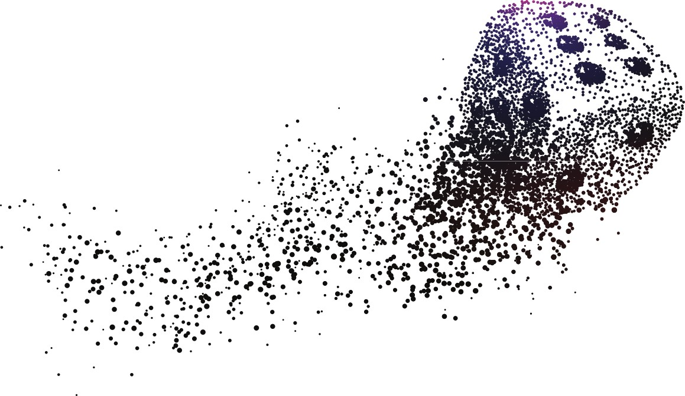

# Suggerimenti per testare il bilanciamento di un dado

Di seguito vi illustro alcuni test che si possono eseguire in casa per verificare il bilanciamento di un dado.

Inizio riportando nuovamente i controlli visivi che si possono effettuare:

1. **Forma:**
   * La forma del dado è simmetrica?
   * Ci sono difformità o imperfezioni evidenti?
2. **Distribuzione del peso:**
   * Tenendo il dado in mano, sembrano esserci lati più pesanti?
   * Facendo rotolare in mano il dado, si sentono differenze di peso?
3. **Qualità della superficie:**
   * Ad una ispezione visiva, risultano irregolarità?
   * Ci sono eventuali ammaccature ad angoli o bordi?

Seguono ora test un pochino più "*scientifici*". I test descritti sono i seguenti:
* [Test di galleggiamento](#Test-di-galleggiamento)
* [Test di rotolamento](#test-di-rotolamento)
* [Test della polvere](#test-della-polvere)
* [Misurazione Meccanica](#misurazione-meccanica)

In ultimo, vedremo come analizzare i dati raccolti
* [Analisi dati](#analisi-dati)

## Test di galleggiamento

Il più popolare dei test è quello di galleggiamento.

* Materiali necessari per eseguire il test:
  * Un contenitore trasparente (plastica o vetro) riempito con acqua;
  * Sale o sapone liquido per aumentare la densità dell'acqua e migliorare il galleggiamento.
* Preparazione per il test:
  * Riempire a tre quarti il contenitore con acqua;
  * Aggiungere qualche goccia di sapone liquido o un cucchiaino di sale all'acqua;
  * Mescolare per diluire il sale o il sapone;
  * Nel caso di sapone, attendere che la schiuma si ritiri;
  * Immergere un dado, se non galleggia, aggiungere sapone o sale.
* Esecuzione Test:
  * Lasciar cadere il dado nell'acqua ed osservare quale faccia torna a galla;
  * Ripetere più volte il test e appuntarsi i risultati;
  * Lasciare il dado galleggiare ed osservate il suo comportamento: un dado bilanciato difficilmente manterrà la stessa faccia esposta verso l'altro.
  * Far rotolare il dado nell'acqua e verificate che la faccia che riemerge non sia sempre la medesima;
  * Appuntatevi i risultati dei vari test.

*I risultati a colpo d'occhio:* 
Sia lasciando cadere il dado che facendolo rotolare nell'acqua, ci possiamo aspettare che compaia sempre una faccia differente. 
Guardando i risultati ottenuti, potete vedere se una faccia del dado è emersa più volte di altre.

## Test di rotolamento
Questo è il più semplice test che potete eseguire.
* Materiali necessari per eseguire il test:
   * Un tavolo piano.
* Esecuzione del test:
   * Lanciate ripetutamente il dado cercando di imprimere sempre lo stesso movimento al lancio;
   * Ripetete il test quante più volte potete (non meno di 100) ed annotate i risultati

*I risultati a colpo d'occhio:* 
In un dado bilanciato, nessuna faccia dovrebbe comparire più di altre. Se il numero di volte che è comparsa ogni faccia, non è dissimile, allora il vostro dado è apparentemente bilanciato.

## Test della polvere
Questo può risultare il test più divertente da eseguire.
* Materiali necessari per eseguire il test:
   * Un tavolo piano;
   * Polvere fine come talco o amido di mais.
* Esecuzione del test:
   * Bisogna cospargere uniformemente con un sottile velo di polvere la superficie piana;
   * Fate rotolare un numero considerevole di volte il dado attraverso la polvere;

*I risultati a colpo d'occhio:* 
Osservando l'accumulo di povere sul dado, si pò determinare se alcune facce o bordi siano squilibrate rispetto ad altre.

## Misurazione meccanica
Questa è una misurazione un po' più complessa da eseguirsi se non si hanno competenze meccaniche.
* Materiali necessari per eseguire il test:
   * Micrometro oppure Calibro.
* Esecuzione del test:
   * Misurare ogni faccia del dado in maniera accurata riportando le misure su un taccuino.

*I risultati a colpo d'occhio:* 
Tutte le misure rilevate su ogni singola faccia dovrebbero essere coerenti tra di loro.
Se i dadi sono usati, minime differenze sono da ritenersi normali. 
Anche una scarsa qualità costruttiva potrebbe causare queste differenze.
***

***
## Analisi dei Dati
*... prossimamente ...*
